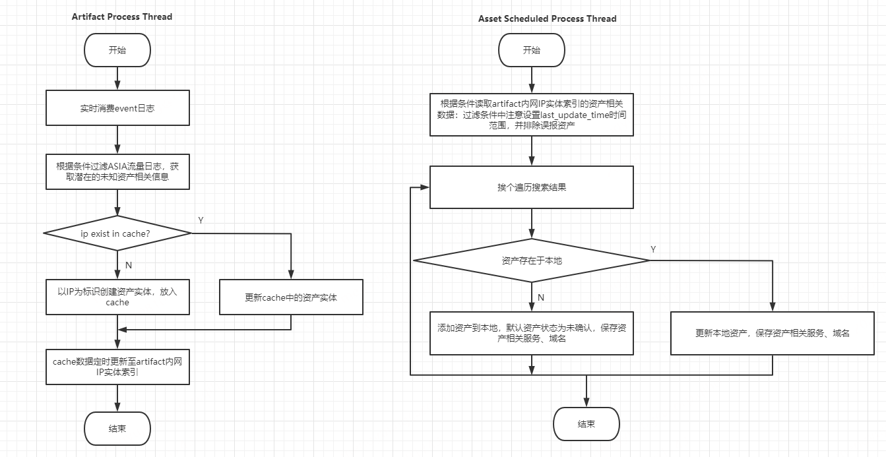

# 被动资产发现

标签（空格分隔）： 一体机, artifact

---

## 需求背景

在不对接天相时，一体机环境没有任何资产数据，除非客户手动添加或导入，这是相对竞品缺失的功能。

## 设计方案

设计思路：

通过实时分析AISA的流量数据，根据一定过滤条件发现内网环境中的潜在资产信息，自动录入及更新。其中：

流量分析及被动资产发现部分交由artifact模块来完成，artifact目前已经有类似被动资产发现的功能，但功能做的比较简单，需要进一步优化；

资产录入、更新部分及与前端页面交互功能交由资产模块来完成。

artifact模块处理流程：

- 实时消费日志数据
- 根据条件过滤潜在未知资产数据，过滤条件: (数据源 = '360AISA(behavior)' or 数据源 = '360AISA(Alert)') and 协议 exist and 事件名称!='dns查询' and 目的地址 belong 内网IP。
- 对于命中过滤条件的数据，提取其中的目的地址作为资产ip，操作系统、操作系统版本信息附加到资产，服务名、服务版本、协议、目的端口可作为该资产的一条服务记录。
- 检查该ip是否是一条已知记录，如果不是，放入缓存；如果是，更新缓存中的资产数据，详细更新策略：如果端口不在资产开放端口记录中，则添加，否则更新端口对应服务信息。
- 启动定时任务线程，定时将资产cache的数据同步至内网IP实体索引。

asset模块处理流程：

- 未对接天相的前提下，启动定时任务，定时搜索内网IP实体索引。可根据索引的更新时间配置搜索条件。
- 获取拿到的资产数据，放入资产索引。

流程图：

## 注意点
1. artifact数据改动暂不确定影响范围。
2. ASIA流量数据可能拿不到服务信息。目前想到的方法是定义一个协议和服务的mapping，在拿不到服务名的情况下，通过协议指定服务名。
3. AISA数据解析优化，目前有些字段没有解析出来。
4. 资产模块在存储数据时，需另起索引。通过被动资产发现识别的资产需要人工确认。资产确认状态：确认/误报/未知，默认为未知。
5. 资产模块在存储数据时，需要考虑资产更新及人工确认后的行为。
6. 资产的服务、域名这些是否需要确认？无需确认。
7. 资产模块目前于artifact有交互，增、删、改、导入都会发送消息通知给artifact，注意下，删除、变更资产状态为误报时，记录资产信息，后面查询的时候滤除。

## ELSE
之前有考虑被动+主动相结合
调研过主动的思路：使用nmap工具，主动探测服务及服务版本信息
奎哥疑问：
1. 是否需要从payload读取服务信息；
2. 资产如何做更新；
3. artifact需要哪些改造；
4. 是否需要资产指纹库；
5. 用于资产发现的日志是否有要求，哪些协议有哪些要求
6. 识别的资产如何存储
7. 资产更新的频度
8. 被动识别的资产和终端的数据或者已有资产列表的数据如何整合
优先看app_name，如果没有，根据协议获取，可能拿不到版本信息。4和5是需求相关的，对协议有没有限制？只关注应用层协议？关注的服务呢？这涉及到资产指纹库的配置。讨论后决定指纹库暂时不做。
资产定时读取artifact内网ip实体数据，写入资产索引。经这种方式识别的资产需要用户手动确认。识别时重点关注目的地址、操作系统、操作系统版本、服务名、服务版本、协议、目的端口、域名。当前系统中资产绑定的有服务、域名、网站信息，网站这块我们不支持。

