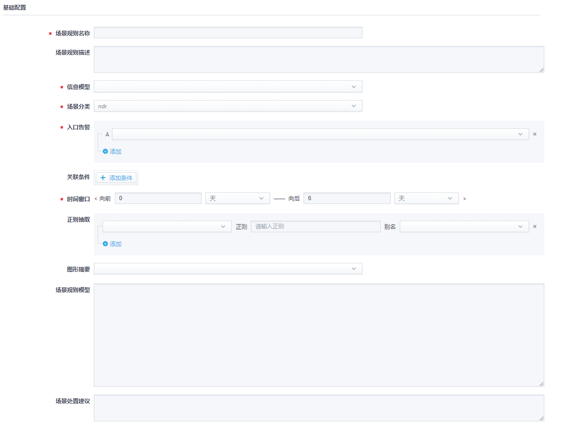
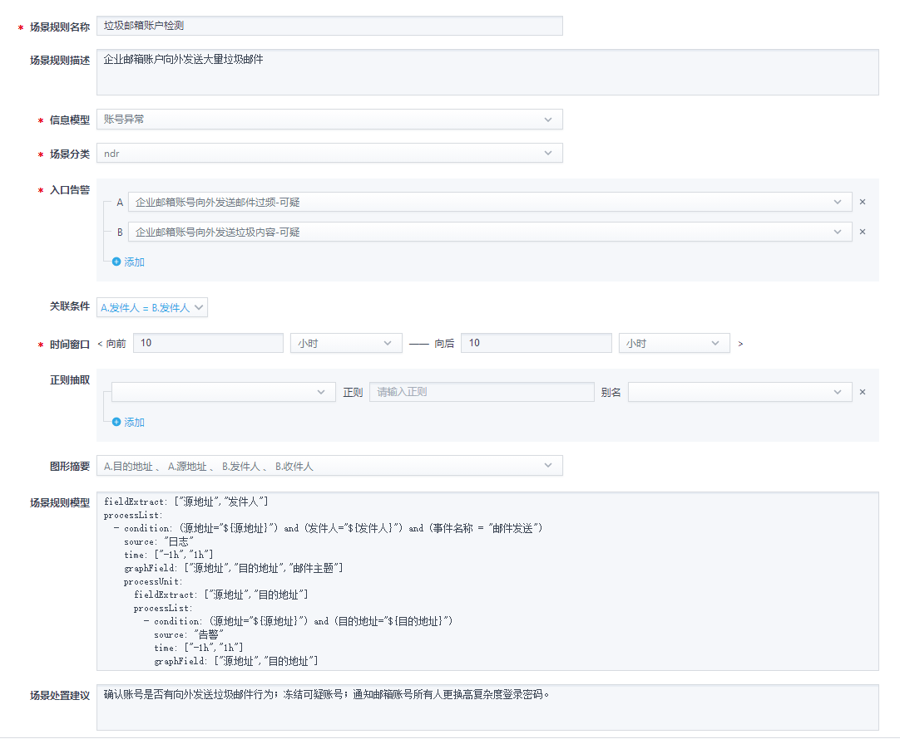

# ICE安全场景模型规则配置说明

标签（空格分隔）： ICE_DESIGN

---

ICE规则用于根据入口告警生成安全事件，通过ICE规则，安全事件分析引擎可以实时地将与安全事件相关的其他日志和告警提取出来，提供给安全运维人员分析。
(本地存储位置：E:\Projects\360本地安全大脑\ice_rule_config)

## 规则配置规范

ICE规则配置页面参考下图：



下面对每个配置项进行详细说明：

- 场景规则名称：规则名称，该规则生成的安全事件以此命名，必填项。

- 场景规则描述：规则描述信息，选填项。

- 信息模型：规则所属信息模型，从下拉列表中选择，必填项。

- 场景分类：规则所属场景分类，从下拉列表中选择，必填项。

  当前环境支持的场景分类选项及对安全事件和告警数据的影响：


  | 场景分类 | 安全事件                             | 告警                                                         |
  | -------- | ------------------------------------ | ------------------------------------------------------------ |
  | edr      | - 可绘制EDR进程树<br>- 无攻击链路图  | <br>- 默认direction_key提取字段: 客户端标识, 当天日期<br>- 默认merge_key提取字段: 告警id<br>- 无geo信息 |
  | ndr      | - 可绘制攻击链路图<br/>- 无EDR进程树 | <br>- 默认direction_key提取字段: 规则id, 告警名称hash, 攻击方向<br/>- 默认merge_key提取字段: 规则id, 源地址, 目的地址, 告警内容hash<br/>- 补全geo信息 |
  | xdr      | - 可绘制攻击链路图<br/>- 无EDR进程树 | <br>- 默认direction_key提取字段: 规则id, 告警名称hash, 攻击方向<br/>- 默认merge_key提取字段: 规则id, 源地址, 目的地址, 告警内容hash<br/>- 补全geo信息 |

- 入口告警：触发该规则的关联分析规则名称，可通过添加按钮配置多个，多个告警之间是或的关系，表示任意一个选择的告警都可以触发生成该安全事件。必填项。

- 关联条件：提取入口告警的字段，做进一步配置，以达到告警名称相同而字段值不同的情况下能生成不同的安全事件的目的。目前只支持AND逻辑，各个表达式只支持等于操作符，选填项。

  demo: 配置两个入口告警A和B，配置关联条件为"A.源地址=B.目的地址 and A.目的地址=B.目的地址"，则满足如下条件的告警都可以合入同一个安全事件。

  ```
  (alarm_name="A" and src_address="key_0" and dst_address="key_1") or (alarm_name="B" and src_address="key_1" and dst_address="key_0")
  ```

  - 如果收到A告警，源地址为“1.1.1.1”，目的地址为“2.2.2.2”，则生成一个安全事件；
- 后续收到B告警，目的地址为“1.1.1.1”，源地址为“2.2.2.2”，满足配置的时间窗口条件，则合入该安全事件；
  - 后续收到A告警，源地址或目的地址跟上面A告警不同，则新生成一个安全事件；
  - 后续收到B告警，源地址或目的地址跟上面B告警不同，则新生成一个安全事件；
  
- 时间窗口：设置时间窗口长度，时间单位可选择天(d)/时(h)/分(m)。该参数的作用是在入口告警触发生成安全事件后，搜索指定时间范围内的告警合入该安全事件，必填项。

- 正则抽取：对所选字段进行正则提取后重新映射成别名字段进行关联查询。在场景规则模型中可使用别名字段，选填项。

- 图形摘要：提取字段用于绘制攻击链路图，允许选择多个，选填项。

- 场景规则模型：yaml语法格式，通过模型配置，搜索环境中所有相关的日志和告警，合入该安全事件。整个模型为一个ProcessUnit，允许多层级联嵌套。选填项。模型参数说明如下：

  | 参数         | 说明                                                         |
  | ------------ | ------------------------------------------------------------ |
  | fieldExtract | 需要提取的上级数据字段数组，在condition中可以使用${}引用字段，以使用上级数据的字段值来做本层过滤。字符串数组类型，必备字段。 |
  | processList  | 处理逻辑列表，列表类型，必备字段。列表的每个元素为一个核心处理单元ProcessCore，该类型包含下面几个字段。 |
  | condition    | 过滤条件，hql语句，写法类似查询页面的查询条件，可以使用具体值，也可以使用${}引用fieldExtract中的字段。字符串类型，必备字段。 |
  | source       | 查询数据源，可配置为日志或告警。字符串类型，必备字段。       |
  | time         | 时间窗口配置，支持天时分，字符串数组类型，必备字段。         |
  | graphField   | 用于绘制攻击链路图的字段数组。字符串数组类型，选填字段。     |
  | essential    | 安全事件是否可见控制参数，布尔类型，选填字段。<br>没有配置或配置值为false，安全事件生成后即可见；配置值为true，则安全事件搜索到满足条件的日志或告警后才可见。 |
  | processUnit  | 嵌套的ProcessUnit，类型参数即上述参数。                      |

- 场景处置建议：场景处置建议描述，选填项。

## 规则配置举例

规则配置demo参考下图，下面对每个配置项进行详细说明：



- 场景规则名称：垃圾邮箱账户检测，所有触发该规则生成的安全事件都以此命名。

- 场景规则描述：企业邮箱账户向外发送大量垃圾邮件

- 信息模型：账号异常

- 场景分类：ndr，该安全事件可绘制攻击链路图

- 入口告警：两个，[A="企业邮箱账号向外发送邮件过频-可疑", B="企业邮箱账号向外发送垃圾内容-可疑"]，其中任意一个告警都可触发该规则，生成安全事件。

- 关联条件：A.发件人=B.发件人。

- 时间窗口：["-10h","10h"]

  发件人相同的、结束时间在前后10小时之内的任意一个A或B告警都可以生成/合入同一个安全事件。如果后续有新的告警数据合入，结束时间窗口会继续往后推延10个小时。直至10小时内没有任何新的告警合入，该安全事件不再更新。

- 图形摘要：A告警取源地址、目的地址字段绘制攻击链路图；B告警取发件人、收件人字段绘制攻击链路图。

- 场景规则模型：具体内容即说明如下。
  - 每当有入口告警被合并到安全事件中，都会根据yaml定义的搜索层级，查询ES中符合条件的日志或告警
  - 场景模型定义的搜索采用分层结构，每一层搜索的结果会级联创建下一级搜索
  - 搜索到的日志或告警会被聚合到安全事件中，并根据预定义的合并策略，归并为不同的合并日志/告警卡片
  ```yaml
  # 字段提取：定义下文condition中使用到的字段
  fieldExtract: ["源地址","发件人"] 
  processList:
      # 基于入口告警搜索符合条件的日志
    - condition: (源地址="${源地址}") and (发件人="${发件人}") and (事件名称 = "邮件发送")
      # 支持“日志”或“告警”
      source: "日志" 
      # 以入口告警时间为基准，搜索前后1小时内的日志
      time: ["-1h","1h"] 
      # 提取搜索到的日志中的源地址、目的地址、邮件主题三个字段用于绘制攻击链路图
      graphField: ["源地址","目的地址","邮件主题"] 
      # 定义子搜索，本级搜索到的每条日志都会级联创建子搜索
      processUnit:
        fieldExtract: ["源地址","目的地址"] 
        processList:
          - condition: (源地址="${源地址}") and (目的地址="${目的地址}")
            source: "告警" 
            time: ["-1h","1h"]
            graphField: ["源地址","目的地址"] 
  ```
  
- 场景处置建议：确认账号是否有向外发送垃圾邮件行为；冻结可疑账号；通知邮箱账号所有人更换高复杂度登录密码。


## ICE XDR安全事件改造
2.5版本ice处理流程更新：
先生成合并告警，再生成安全事件
合并告警与安全事件不再是一对一的关系，而是一对多。
合并告警有个incident_id字段，标识关联的安全事件，数组类型。
related索引只保存合并告警与原始告警的关系。
安全事件时间窗口固定，不会随着告警或日志的加入往后延。
https://sdpm.360zqaq.net/wiki/#/team/RV33dmC8/space/W7Dd7tYm/page/AsdSB23e
https://sdpm.360zqaq.net/wiki/#/team/RV33dmC8/space/W7Dd7tYm/page/M61xJvU6


