# 分析引擎debug页面介绍

标签（空格分隔）： SAE_DOC

## 引擎debug页面访问

进入关联分析页面，将浏览器url中的/cep/rules替换为/cep/debug，刷新，即可进入分析引擎debug页面。页面展示及说明如下：

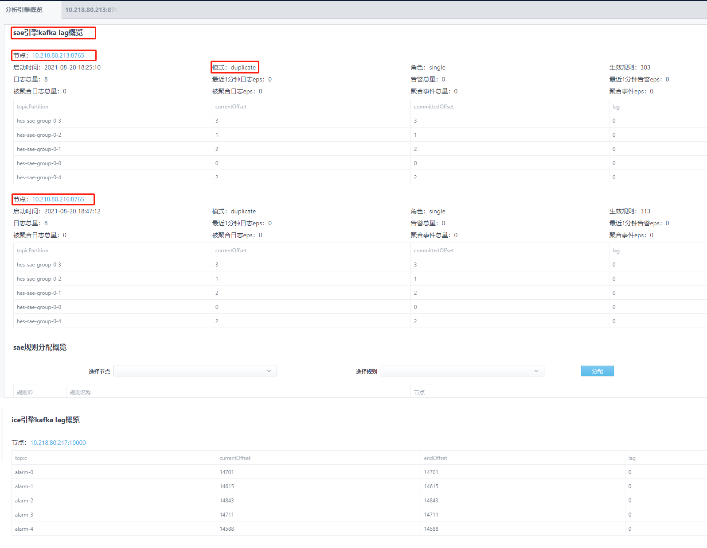

### sae引擎kafka lag概览

- 节点信息：展示了sae引擎详细的运行状态信息，包括启动时间、运行模式、加载规则数量、接收日志总量、生成告警总量、消费日志eps、生成告警eps等。点击节点连接，可跳转到sae节点debug页面。

- 模式：sae引擎的运行模式，有single(单机)、duplicate(分规则的分布式)、及cluster(分级部署的分布式)三种。single模式下只有一个节点；duplicate和cluster模式下可存在多个节点。

- kafka各个topic分区的offset情况，包括Current Offset、Committed Offset及消费lag，lag越大，表示消费速度越慢。

- sae规则分配概览：duplicate模式下，可手动设置分配某一规则交由指定节点处理，或移除某个节点上手动分配的规则。

### ice引擎kafka概览

- 节点信息：展示了ice引擎的告警处理信息。点击节点连接，可跳转到ice节点debug页面。

## sae引擎节点debug页面访问

点击sae节点链接，进入节点debug页面，页面展示如下图所示：

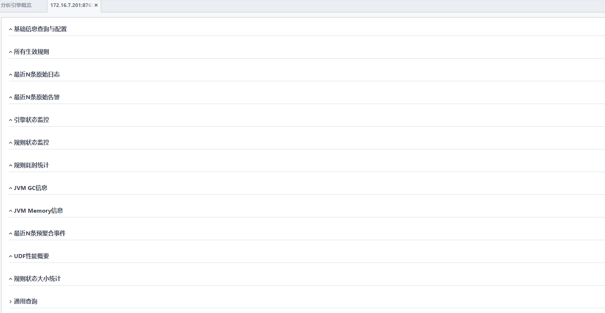

### 基础信息查询与配置

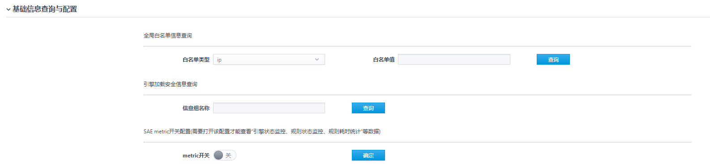

- 全局白名单查询：选择全局白名单类型，输入值，点击查询，看查看该值是否属于全局白名单

- 引擎加载安全信息查询：输入信息组名称，可以查看引擎加载的安全信息内容

- metrics开关：最近N条原始日志、最近N条原始告警、引擎状态监控、规则状态监控、规则耗时统计等数据需要打开metrics开关才可以查看。

### 所有生效规则

展示所有引擎加载的规则信息，可通过规则名称进行查询。

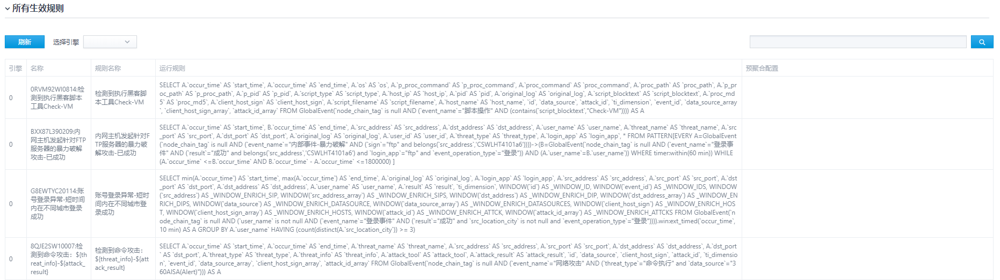

### 最近N条原始日志

展示引擎最近消费的200条日志信息，需开启metrics开关。

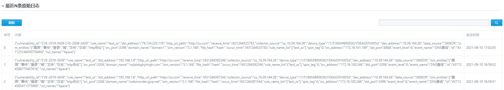

### 最近N条原始告警

展示引擎最近生成的200条告警和内部事件信息，需开启metrics开关。

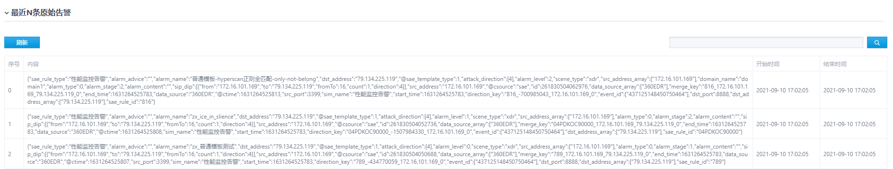

### 引擎状态监控

展示引擎的运行状态，输入数据量，输出数据量，需开启metrics开关。

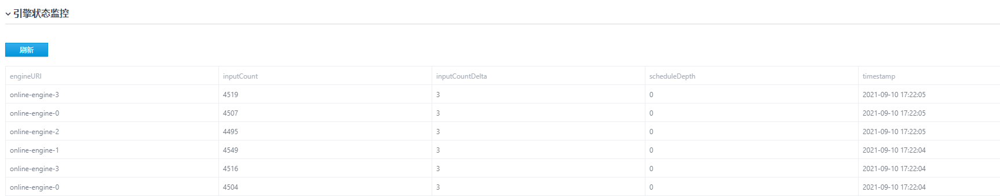

### 规则状态监控

展示规则的运行状态，包括规则名称，规则耗时，满足规则条件的数据量，规则输出的数据量，需开启metrics开关。

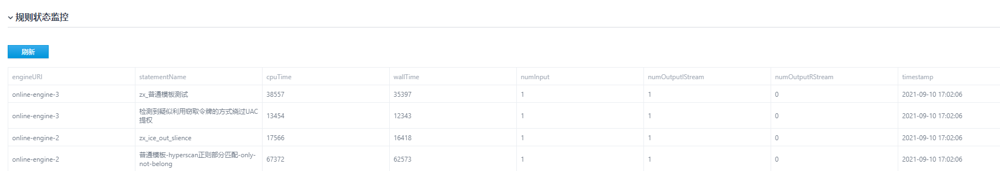

### 规则耗时统计

展示最近10次触发规则的状态，包括规则名称，规则耗时，满足规则条件的数据量，规则输出的数据量，需开启metrics开关。

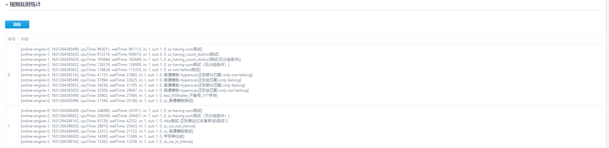

### JVM GC信息

展示进程GC信息。

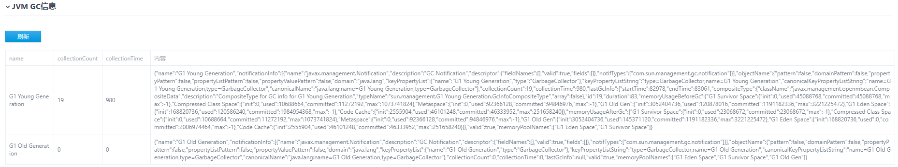

### JVM Memory信息

展示进程内存使用情况。

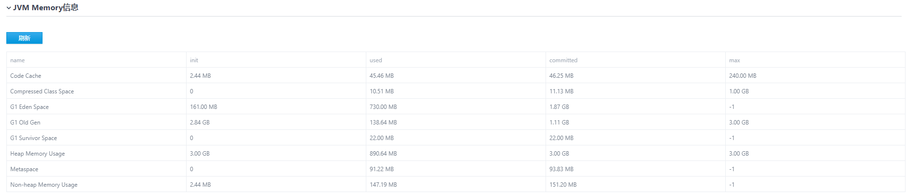

### UDF性能概要

展示一些自定义函数的耗时信息，需开启metrics开关。

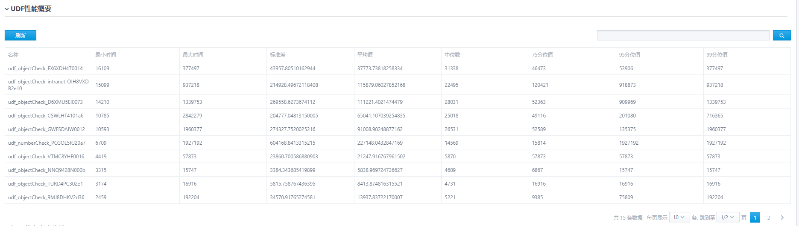

通过UDF耗时统计，以及规则cpuTime值，可以定位耗时大的规则。

### 规则状态大小统计

展示统计类、关联类的规则中，满足条件的数据在内存中的计数情况。

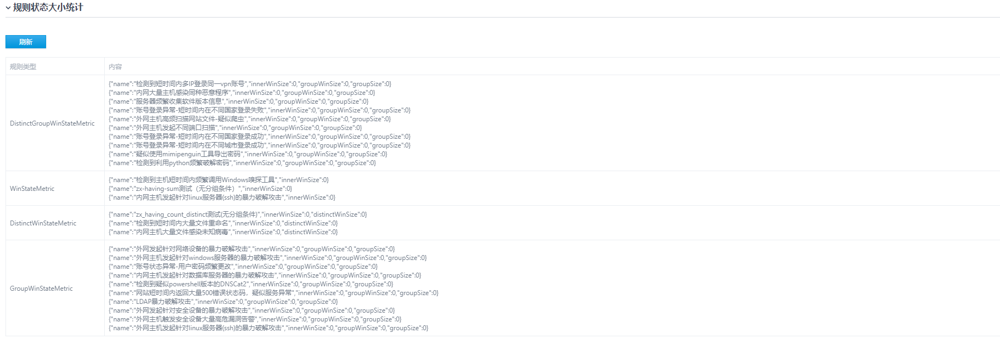

统计类规则中，groupSize越大，分组数量越多；innerWinSize越大，数据缓存越多，内存占用越大。

关联类规则中，subExpression越大，数据缓存越多，内存占用越大。

### 通用查询

调用sae-core内置的一些debug接口，查询信息。

### sae-core debug接口

- /api/cep/core/debug/rule/state/any-order/{ruleId}，根据规则id获取sae-core引擎的内存状态，规则必须是关联模板-any order的规则。

- /api/cep/core/debug/rule/state/not-before/{ruleId}，根据规则id获取sae-core引擎的内存状态，规则必须是关联模板-not before的规则。

- /api/cep/core/debug/rule/state/not-occur/{ruleId}，根据规则id获取sae-core引擎的内存状态，规则必须是普通模板-not occur的规则。
- /api/cep/core/utils/intelligence, get(id), 获取该id安全信息组具体内容
- /api/cep/core/utils/intelligence/query, get(ig, type, group), check特征内容是否属于安全信息组，ig为内容，type为特征类型(string/num/ip/full_regex/half_regex/time)，group为信息组id。ex: /api/cep/core/utils/intelligence/query?ig=127.0.0.1&type=ip&group=信息组id,比如内网IP，id为CSWLHT4101a6
- /api/cep/core/utils/asset/query, get(ip)，check 该ip是否属于资产

## ice引擎节点debug页面访问

点击ice节点链接，进入节点debug页面，页面展示如下图所示：

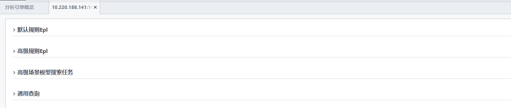

### 默认规则Epl

展示当前活跃的，由默认策略生成的安全事件。支持根据安全事件id进行搜索。满足条件的告警数据会合入相关安全事件，如果所有条件都不满足，则新生成安全事件。

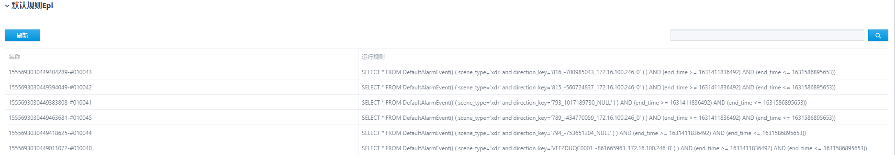

### 高级规则Epl

展示当前活跃的，由高级场景ice规则生成的安全事件。支持根据安全事件id进行搜索。如果高级场景引用到了该告警关联的sae规则，则会根据是否满足规则条件，合入或新生成相关的安全事件。

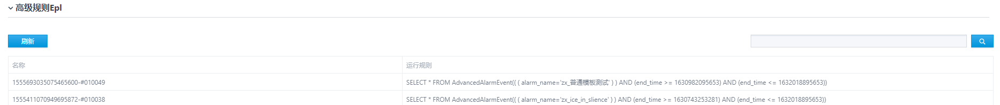

### 高级场景模型搜索任务

如果安全事件为高级场景的安全事件，而且高级场景规则中配置了级联搜索，可以根据安全事件id，查询级联的搜索任务。

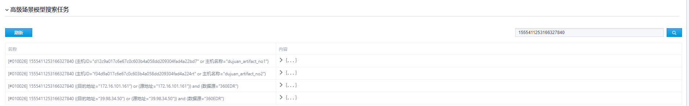

每行的内容展示了安全事件在cache中的详情信息，搜索的dsl，当前的搜索结果等。

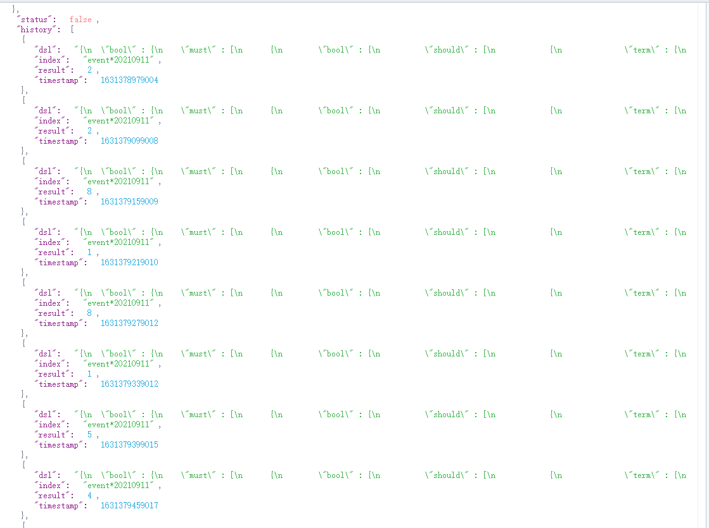

