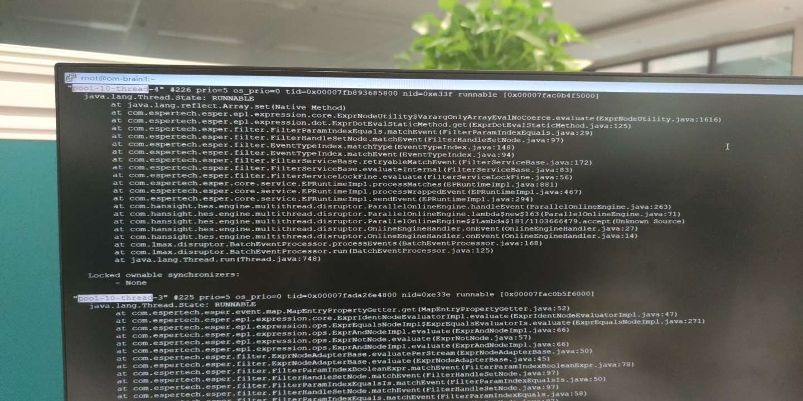
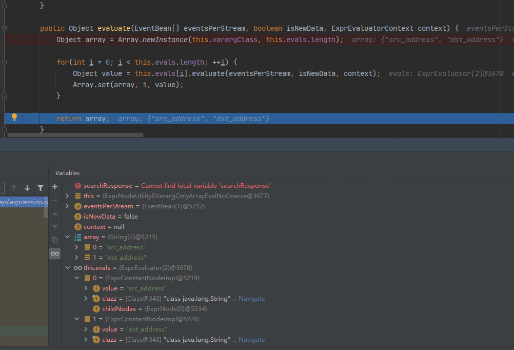
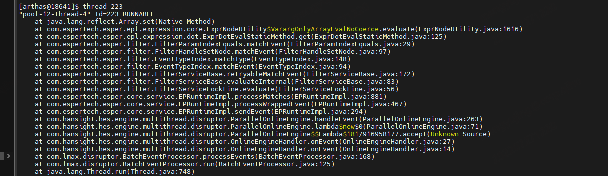
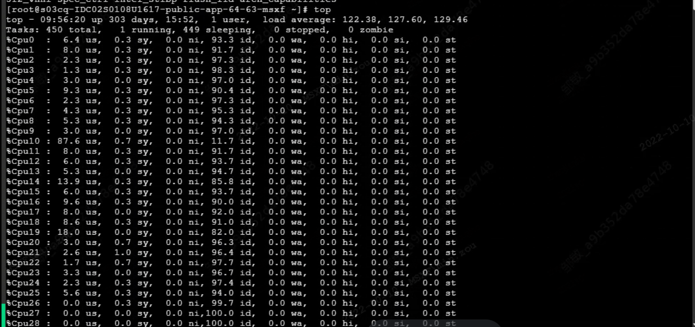
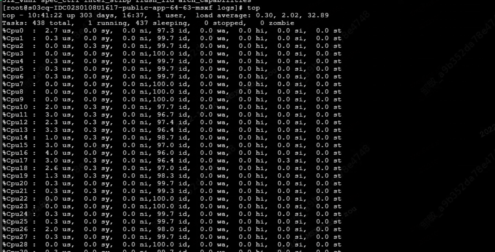
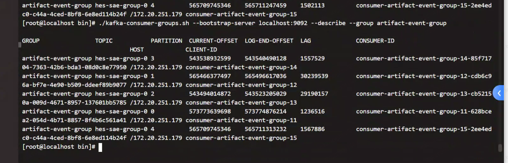
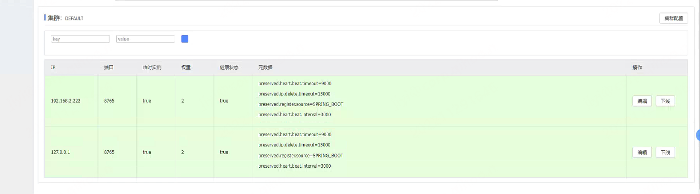

标签（空格分隔）： SAE_DIAGNOSE 360BrainSecurity

---

# 2020-07-02 百胜环境sae报ClassCastException，数据堆积严重，告警无法正常生成

异常信息：com.espertech.esper.client.EPException: java.lang.ClassCastException: java.lang.String cannot be cast to java.lang.Number
问题定位：
使能debug，读取DefaultMsgCb的日志，发现dv发过来的数据中event_level字段类型错误，正常应为整形，dv数据中该字段为字符串类型。建议修改解析规则。
比如，规则中配置了event_level>2，而数据中event_level='INFO'，在调用esper sendEvent时会抛出该异常。
另外，百胜环境为分布式部署，数据量很大，该异常会导致大量数据无法进入引擎做匹配，也降低了引擎的处理速度，导致数据堆积，告警无法正常生成。

# 2020-07-06 百胜环境sae某规则无效，无法正常生成告警

问题定位：
该规则为统计类规则，事件源为全局事件，根据当前的分布式逻辑，会生成临时事件交给dv转发。
执行历史任务，数据是可以正常生成告警的，断定规则是没有问题的。
百胜环境sae为分布式部署，数据量很大，调用接口查看临时事件的分组情况、各个sae消费topic的情况、各个topic的eps及lag后发现，该临时事件所在的topic eps很大，lag也很大，当前没有sae去消费，得出规则无效的原因。
解决方法：增大sae-core的balance.ability配置，使某个sae有能力去消费该topic的数据，以解决这个问题。
***注意***：当前的分布式方案还是存在不少问题的，毕竟数据是没办法均分的，如果一个topic eps过高就容易出现这种问题。但单纯改配置文件也不能彻底解决，毕竟sae的处理能力是受限的，这样很容易导致lag过大，一部分数据还没来得及消费就丢了，告警可能并不是连续的，只能暂时先这样。

# 2020-07-06 百胜环境sae规则重复告警，告警关联同一个id

问题定位：
该规则为统计类规则，事件源为全局事件，根据当前的分布式逻辑，会生成临时事件交给dv转发。
猜测是dv worker重复发送同一临时事件导致。
消费临时事件topic及临时事件所在的group对应的topic，搜索溯源id相关的日志发现，对于一个id，dv重复发送5次，与环境中重复5次告警相吻合，问题原因找到。

# 2020-07-10 建行定制化环境esper抛异常 array element type mismatch

问题定位：
从客户环境来看，出现该异常的是统计类规则，猜测是window函数出错。
当前使用window function的有以下几个字段：
- id, event_id
- src_address, src_address_array
- dst_address, dst_address_array
- data_source, data_source_array
猜测是部分字段的属性类型不匹配导致。
连接客户环境数据库，system_attribute中可由sae加载的属性中id有两个：
| attr_field   | attr_name   |  attr_type  |  type  |
| --------   | -----  | ----  | ----  |
| id   | 事件ID  | long  | 1  |
| id   | 告警ID  | String  | 130  |
sae给esper配置的id类型是long，日志中数据类型为String，导致window function报错。
***建议***：属性这边如果所属数据源相同或有包含关系的话，字段名称就不要重复，这样容易出现问题。

# 2020-07-10 360内测环境DefaultMsgCb抛空指针异常

问题定位：
从抛异常的位置来看，是specialCheck(Map data) function在将数组元素做数据类型转换时抛的空指针异常，猜测是数组元素为null导致。
使能debug，读取DefaultMsgCb的日志：
```
2020-07-10 18:48:18,165:DEBUG pool-kafka-input-pool-1 (KafkaIn.java:142) - get message, topic: hes-sae-group-0, partition: 1, offset: 792744491, message: {"receive_time":1594378098163,"collector_source":"样本鉴定结果","file_md5":[null],"event_level":0,"scan_result_desc":"scan ok","file_name":[null],"occur_time":1594378080000,"commit_src":"ndr","event_name":"样本鉴定","status_code":0,"rule_id":"2510a37b-ac34-4fbd-b85c-4a5e3f0e0b89","scan_hash":"3b4226650ed2797c009f02b4a6190dc4","id":"282412257537687555","event_type":"/WAGZZ22N0010/WEGFKEIT0011","rule_name":"360NDR_ScanHash_JSON","scan_time":"2020-07-10 18:48:00","scan_result":30,"dev_address":"10.16.195.4","vendor":"360","data_source":"NDR样本扫描规则","submit_time":"2020-07-10 18:48:00","association_key":"3497158908690744","product":"网络神经元"}
```
该日志中，file_md5及file_name两个字段为数组类型，元素为空。
已修改代码，强化数据类型转换部分的处理逻辑，确保不会抛异常。

# 2020-07-23 农行，follow-by规则无效

问题定位：
农行follow-by规则，事件A为内部事件，事件B为全局事件
从规则epl来看，会对A事件和B事件的id字段做check，确保A.id!=B.id，但内部事件没有生成id字段，导致告警无法正常生成。
修改方法：
为内部事件赋值id字段，取值为event_id字段中的任意一个，注意不能随便为其赋值一个id，这样做是为了保证溯源id的正确性。

# 2020-07-23 建行历史任务

当前历史任务是依次执行的，没有并发执行。建行需求有些不合理，他们频繁执行历史任务，嫌执行速度慢。
1. 需要了解的信息
 - sae-core数量
 - 历史任务总量，尚未完成的任务
 - 环境eps大概多少，1min大概多少数据
 - 各个sae-core当前的log，包括sae-core，scramble
 - 任务执行情况：各个sae-core的log。从昨天截图看，那个sae-core已经执行了297、301、304、305、306这几个job
 ```
   任务执行关键字：
    scramble: "processing history task"
    sae-core: "history task:{} has analysed {} datas"
 ```
2. 影响历史任务执行速度的因素

 - es
 - 历史任务配置，包括时间区间，规则
 - 机器性能

3. 个人观点：

 - 不支持历史任务只交给一个sae去处理，历史任务的执行是抢占式的，谁抢到了就去执行。 
 - 频繁创建历史任务是不合理的，不要频繁创建删除历史任务。一是频繁读es，对es及涉及es操作的其他模块的处理速度有影响。二是线程运行会占用机器内存，影响机器性能，进一步影响实时engine的处理速度。
 - 客户对历史任务的功能理解不正确。它的适用场景是，我创建了一个规则，规则启动后，有满足条件的数据过来，但并没有生成告警。我执行一下历史任务，定位一下原因。它的存在是为了验证规则的有效性，至于规则的逻辑是否合理、告警是否有效是由安全人员去负责和保证的。建议同客户说清楚。
 - 我不明白为什么客户频繁创建历史任务。客户如果想要检查是否生成告警，直接去告警页面查询即可，这样速度快，效率高，毕竟这些数据曾经实时过，曾经交给实时engine处理过，直接根据过滤条件查询即可。客户当前的做法是没有任何效率的，也没有什么意义。
 - 客户应该关注的是告警及安全事件，客户需要去对安全事件及触发安全事件生成的告警进行分析和处理，而不是关注在告警是否生成上。

# 2020-07-27 农行，not-follow-by规则无效

问题定位：
农行not-follow-by规则，事件A为内部事件，事件B为全局事件
自测，sae-core输出log, "invalid alarm, event id array length error"，看了一下FurionProcess的处理逻辑，针对NBF及NFB模板，都对event_id length有等于1的要求，否则报错。这样做是不合理的，内部事件可能存在event_id长度大于1的情况，在这种情况下，使用这两个模板时就会导致sae认为生成的告警是一个无效的告警。已修复。

# 2020-08-05 360demo环境，having count distinct模板规则误报

规则配置：having count(distinct(dst_address)) >= 20触发告警，但生成的告警中，目的地址组元素数量不到20。 
问题定位：调试发现，是之前修改esper源码导致的问题：
针对统计类规则，为了触发告警后将状态清零，奎哥对源码进行了修改，增加了clearTag变量，记录上次移除前的状态，以便下次remove的时候先移除上次的状态。但clear/leave function处理存在问题。
前段时间倚天改了一下esper源码，触发后就把timewindow的数据清掉了，这个clearTag也就没有用了，所以我们又将Esper中clearTag的机制移除，恢复为之前的源码。
统计类规则的3个模板应该都存在这个问题。目前已经修复。

# 2020-08-17 国家保密局rel630 sae分布式环境，多个sae消费同一个topic

多次调用sae-core的debug接口，发现多个sae-core重复消费topic，查看zk节点，节点数据跟debug接口返回数据不一致。最后只保留1个sae，其他停掉，通过scramble日志来看，sae频繁监听到自身节点被remove的消息，不停的remove，监听到自身节点被remove之后又去抢占节点，create kafka consumer，怀疑是zk的问题。
重启zk后，log正常，目前启动2个sae，能正常消费数据。
```
cmd:
先执行命令：export CLIENT_JVMFLAGS="-Dzookeeper.clientCnxnSocket=org.apache.zookeeper.ClientCnxnSocketNetty -Dzookeeper.client.secure=true -Dzookeeper.ssl.keyStore.location=/opt/hansight/enterprise/etc/ssl/client_keystore.jks -Dzookeeper.ssl.keyStore.password=hansight -Dzookeeper.ssl.trustStore.location=/opt/hansight/enterprise/etc/ssl/client_truststore.jks -Dzookeeper.ssl.trustStore.password=hansight -Dzookeeper.ssl.hostnameVerification=false"

cd /opt/hansight/enterprise/zookeeper/
bin/zkCli.sh
get /sae_distribution/eventGroup/group-x/engine/core, group-x换成group-0到9

```

# 2020-08-18 hotfix-rel630 patch测试功能点

- 内部事件id不存在导致规则follow-by规则无效
- esper自定义函数返回值改动，针对过滤条件，操作符：like(字符串包含)，belong(所有类型情报匹配)，in(ip类型)
  改动前，如果事件中的属性不存在，函数直接返回false，那如果配置not filter，则为true，导致告警误报。
  demo: not 源地址 belong 内网IP, 事件源地址不存在，改动前filter为true，匹配，生成告警；改动后filter为null，不匹配，不生成告警。

# 2020-08-21 建行历史任务无法执行问题

现象：暂停前一个历史任务，新建一个历史任务执行，但该历史任务无法正常执行，一直处于waiting状态。
原因分析: 462历史任务执行的时候，sae对461 job的执行线程还没有停止，isBusy=true, sae在执行462前，会check isBusy的值，而check时，isBusy还没有变为false，导致462无法执行了。 
基于zookeeper的这部分代码，我们只是在检测到新建/删除时去处理历史任务，然后开启线程遍历执行。现在的情况是461线程退出了，但462执行时return false了，导致没有再次开启线程。这是sae的一个bug。两个任务切换时也没有sleep。
解决方法：前一个历史任务停掉之后，过段时间再执行下一个。

# 2020-08-21 建行规则停止及删除后告警仍不断产生问题

现象：停止及删除一个规则后该告警仍不断产生，从告警页面看，告警量仍持续增加。
原因分析: 猜测是规则停止/删除的redis消息sae-core没有接收到，导致规则仍在esper中运行。调用reloadRule接口后，从debug页面已经看不到该规则，说明规则已经从esper中移除了。停掉数据源后，告警页面数量仍不断增加的原因，分析是该规则为普通模板，告警生成较多，告警数据堆积较严重，ice那边一时处理不过来，消费告警数据写入es也需要时间，导致告警页面数量不断增加。大概半小时后，该告警数量不再上涨，重启数据源后，也没有新的告警生成，说明问题已解决。
解决方法：调用reload接口。

# 2020-08-24 建行or-follow-by模板规则重复问题

现象：or-follow-by规则，事件A和B都为全局事件，两个过滤条件一样，关联条件：A.A段!=B.A段 and A.用户名称=B.用户名称。
原因分析: 一开始猜测环境是分布式部署的，规则中事件源使用的是全局事件，在运行过程中，如果有事件满足条件，会生成临时事件。你们的这个情况，应该是溯源的这两个事件，每一个事件都满足A和B的过滤条件，每一个事件都生成了两个临时事件再做匹配，导致重复告警。但后来看配置，环境是单机的。自己在本地尝试复现，A/B为全局事件或具体事件，采用or-follow-by模板，两种pattern都满足，一定会出现这个问题。采用follow-by模板则没有这个问题。
解决方法：换成follow-by模板，or，根据他们的规则配置，建议改为distinct模板：分组字段：用户名称，distinct 字段：A段，条件>=2。

# 2020-08-26 内测环境，单机模式，sae-core不消费数据

现象：从log来看，sae重启后，新建了kafka consumer，但立马删除了，sleep一段时间后再次去抢占节点时，zookeeper报nodeExist error，导致sae没有重新创建consumer来消费数据。
原因分析：这不应该说是sae的问题，倒像是zookeeper或curator的问题。
解决方法：现场如果碰到这种问题，可手动调用deleteNode接口，这样sae就会监听到这个消息，再次抢占。代码逻辑强化的话，可以在监听到node节点删除的消息时再次remove一下，确保path确实删除了。

# 2020-08-28 内测环境，单机模式，样本鉴定相关告警无法正常生成，规则为普通模板

现象：消费kafka数据，dv没有将数据发到kafka，看事件查询，该事件的occur_time超前receive_time有10min多。dv有个配置：/opt/qihoo/soc/dataviewer/worker/plugins/dataviewer-plugin-worker-sae-2.x_3.x/conf，对时间过迟/超前的数据直接过滤，不发往kafka。
解决方法：修改dv配置，sae.time_offset.enable=false，重启dv。

# 2020-08-28~2020-09-02 国保630环境，分布式模式，sae-core内存占用过高，无法正常运行

现象：这个问题已经持续很多天了，sae基于zk分布式部署，eps大概5w左右，客户现场一直出现这种现象，sae节点运行一段时间后，隔几分钟就会监听到core节点被remove的消息，去抢占节点，结果节点依然存在，导致抢不到。后来zk连接爆出Unable to reconnect to zookeeper service, session timeout error, 抛出ConnectionLostException。eps相关数据由于没有做同步，接口返回数据也有问题。
原因分析：一开始以为是zk连接有异常，是zk的问题，重启了好几次zk，隔不了多久还是会出现这种问题。看到zk session.time error, connection lost，还有kafka那边老是报commit error，猜测是不是因为数据处理速度过慢导致zk连接有问题。
让客户执行命令看了下内存使用情况，内存占用率99%，gc次数也挺多的，花费时间很长，超过5min。
dump了一份内存出来进行分析，发现是下面这三个规则导致的：
1. 外网主机频繁使用不同参数请求网站特定接口
2. [护网]web访问量高告警
3. [NDR] 流量异常检测
前两个规则是统计类的，分组数量特别多，每个占用内存很大；第三个是follow-by规则，A事件数量很多，但B很少，数据堆积在内存中，导致内存消耗很大。
解决方法：
目前先让客户停掉了这三个规则。也讨论了一下后续的优化思路：
- debug页面增加state size的metric指标展示（降序）
- debug页面支持设置group by win 降级，只保留n个group
- fields截取先不做，低优先级的feature
- follow by的known issue
  - 尽量优化，
  - 指标必须暴露出来
马上金融客户现场也有类似问题，但影响规则不一样，目前只是把排名靠前的几个事件相关的统计类和follow-by类规则关掉了，还在继续排查。

# 2020-09-07~2020-09-09 中央国债6.0GM环境，告警不连续，中间一段时间无告警生成

现象：这个问题已经持续很多天了，现场eps不高，采用单机模式，客户现场经常出现这种现象，从log来看，sae运行一段时间后，内存占用率过高，超过98%，缓存队列满，kafka数据入队失败；session timeout, 与zookeeper断开连接；写入sock文件失败，系统监控页面显示引擎不可用；两次poll时间间隔超过2min，kafka数据提交失败。
原因分析：猜测是规则影响，大量数据堆积在内存，导致内存占用率过高，引擎性能低，eps不到2k。
一般统计类模板规则会导致这个问题，猜测原因有：
1. 数据发生时间乱序，进入引擎后没有被移除，占用内存，这是引擎的一个问题，已修复
2. 规则时间窗口设置较长，大量事件堆积在内存
解决方法：
目前提供了用户一个debug build，通过http://localhost:8765/api/cep/debug/metric/statement/memory这个接口返回数据中的groupWinSize和groupSize可以找到大量数据堆积在内存中的规则，暂时先停掉规则，优化规则，后面考虑如何优化引擎。

# 2020-09-22 百胜5.0sp1环境，告警无法正常生成

现象：规则epl: 事件摘要 rlike ".*'Don't Expire Password' - Enabled.*"，无告警生成，但用该条件在日志查询页面可以正常查询到日志，将该正则表达式放到安全信息组中，使用正则部分匹配可以正常生成告警。
原因分析：
事件中，事件摘要内容为：
```
A user account was changed.
↵
↵Subject:
↵ Security ID: S-1-5-21-2829295983-969874785-2499420963-36228
↵ Account Name: xcw4954
↵ Account Domain: YUMCHINA
↵ Logon ID: 0x6BF4A787
↵
↵Target Account:
↵ Security ID: S-1-5-21-2829295983-969874785-2499420963-28457
↵ Account Name: whn044
↵ Account Domain: YUMCHINA
↵
↵Changed Attributes:
↵ SAM Account Name: -
↵ Display Name: -
↵ User Principal Name: -
↵ Home Directory: -
↵ Home Drive: -
↵ Script Path: -
↵ Profile Path: -
↵ User Workstations: -
↵ Password Last Set: -
↵ Account Expires: -
↵ Primary Group ID: -
↵ AllowedToDelegateTo: -
↵ Old UAC Value: 0x10
↵ New UAC Value: 0x210
↵ User Account Control:
↵ 'Don't Expire Password' - Enabled
↵ User Parameters: -
↵ SID History: -
↵ Logon Hours: -
↵
↵Additional Information:
↵ Privileges: -
```
包含了很多的换行符。
正则语法中，.表示匹配除换行符 \n 之外的任何单字符。
sae的rlike是表示正则全匹配，而.无法匹配换行符，所以在sae规则的过滤条件中直接用.*无法匹配。
解决方法：
1. 将.*改为[\s\S]*，这样sae规则可以正常运行，告警可以正常生成，但这样的话，用这个过滤条件在检索页面无法检索到数据，es搜索不支持。
2. 修改sae esper engine，.支持换行符。

# 2020-10-10 浦发5.5环境，having count规则告警误报，未满足count条件即告警，sae有定制

现象：having count规则，事件源为全局事件，未满足count计数条件即告警，必现
排查思路：
浦发sae有定制，但只是改了下攻击方向为其他的，不提取源地址目的地址，其他跟maintenance分支没区别。5.5版本一直用的老的esper(6.0版本倚天对esper做过改造)，之前客户一直没有报过这种问题，怀疑并不是sae导致的。环境是分布式部署的，分布式情况下，如果使用全局事件，会生成临时事件交给dv再转发一次，怀疑是dv重发数据所致。
告警误报后，根据event_id消费event数据，发现同一个id的event，dv重复多次发送，是dv的问题。
解决办法：dv出patch包。

# 2020-10-20 百胜 sae分布式环境，多个sae消费同一个topic

4个sae-core，多次调用sae-core的debug接口，发现多个sae-core重复消费topic，查看zk节点，节点数据跟debug接口返回数据不一致。看sae-core的节点监听log，部分sae没有监听到节点变动消息，怀疑是zk的问题。
重启zk后，sae-core能正常消费数据，input接口调用正常，无重复消费情况。
```
cmd:
cd /opt/hansight/enterprise/zookeeper/kafka
./zookeeper-shell.sh localhost:2181
get /sae_distribution/eventGroup/group-x/engine/core, group-x换成group-0到9

```
但目前百胜eps很大，有几个topic eps高峰期甚至达到7w，正常3w，单个sae处理不过来，目前已提出人工数据分流的解决方案，依据某个字段做人工分流，尽量保证均衡。

# 2020-11-24 建行内测环境(基于6.0)，sae redis消息不响应，抛异常

从log来看，sae对于所监听的redis消息都无法正常响应。
```
log info: 
(MessageListenerAdapter.java:335) - Listener execution failed
java.lang.NoClassDefFoundError: com/hansight/hes/engine/epl/EplManager$1
        at com.hansight.hes.engine.epl.EplManager.reloadUpdateInRule(EplManager.java:213) ~[classes!/:?]
        at com.hansight.hes.config.RedisReceiver.onMessage(RedisReceiver.java:63) ~[classes!/:?]
        at org.springframework.data.redis.listener.adapter.MessageListenerAdapter.onMessage(MessageListenerAdapter.java:299) [spring-data-redis-1.8.11.RELEASE.jar!/:?]
        at org.springframework.data.redis.listener.RedisMessageListenerContainer.executeListener(RedisMessageListenerContainer.java:249) [spring-data-redis-1.8.11.RELEASE.jar!/:?]
        at org.springframework.data.redis.listener.RedisMessageListenerContainer.processMessage(RedisMessageListenerContainer.java:239) [spring-data-redis-1.8.11.RELEASE.jar!/:?]
        at org.springframework.data.redis.listener.RedisMessageListenerContainer$1.run(RedisMessageListenerContainer.java:967) [spring-data-redis-1.8.11.RELEASE.jar!/:?]
        at java.lang.Thread.run(Thread.java:748) [?:1.8.0_241]
```
使用jmap命令打印出sae-core进程的live objects java object heap。
发现这些对象EplManager$1...都不存在，但jar包中是正常存在的。
最终确定是替换了sae-core.jar但没有重启sae-core所致。

# 2020-11-30~2020-12-01 百胜 sae分布式环境，有topic没有被消费，导致告警骤减

现场环境说明：百胜使用的是5.0的环境，sae采用的是基于zookeeper的分布式架构，现场部署了4个sae-core，该分布式方案无法实现负载均衡。有一个topic eps特别高(hes-sae-group-2, eps=3w)，sae配置文件中配置了ability为6w，还是没有节点能够消费该topic。
现象：调用input接口和eps接口，接口返回数据错误，group-2明明没有被消费，却仍在LoadStatistics的map中，从log来看，sae-core每次尝试消费该topic时，都因该topic的eps被统计在本节点已消费topic中，导致尝试消费时超载，进而导致无法创建consumer消费该topic。数据无法进入esper分析，从而导致告警骤减。
排查思路：尝试在本地复现，发现了问题原因：
sae有多个线程(eps更新&zk节点消息多线程处理&loadBalance)会对LoadStatistics eps做增删操作，但并没有做线程同步，导致出问题。
默认eps更新1min执行一次，eps更新时会读取当前的input，把eps信息放到LoadStatistics中，但节点处理remove消息时从removeLoad到input真正被destroy耗时可能超过1min，这样会导致该topic又再次被放到LoadStatistics中，而实际上该topic已经不再被该sae消费了，导致eps统计错误，eps接口返回数据错误。
```
eps更新：
public synchronized void updateEPS() {
        Set<InBase> inBaseSet = new HashSet<>(InBase.getAllInput());
        if (inBaseSet == null || inBaseSet.isEmpty()) {
            log.info("empty input object.");
            return;
        }
        try {
            inBaseSet.stream().forEach(inBase -> {
                try {
                    if (!(inBase instanceof KafkaIn))
                        return;
                    int eps = 0;
                    String topic = ((KafkaIn) inBase).getTopic();
                    String ePath = ZkUtil.getPath(EVENTGROUP_NODE, StringUtils.remove(topic, TOPIC_PREFIX), ENGINE_NODE);
                    EngineNodeData engineNodeData = zkManager.getNodeData(ePath, EngineNodeData.class);
                    if (engineNodeData != null) {
                        eps = engineNodeData.getEps();
                    }
                    if (eps < 0)
                        eps = 0;
                    LoadStatistics.addLoad(ZkUtil.getPath(ePath, ZkNodeConstant.PARTITIONS_CORE_NODE), eps);
                } catch (Exception e) {
                    log.error("exception: {}", e);
                }
            });
        } catch (Exception e) {
            log.error("update eps failed: {}", e);
        }
    }
```
解决方法：加锁，保证每次只有一个线程操作LoadStatistics。eps更新改为通过LoadStatistics方式。另外，由于节点变动消息不频繁，改为采用单线程处理。

# 2021-08-11~12 建行6.0beta定制版本生产环境，having count模板规则告警生成问题分析

现场环境说明：建行生产环境使用的是基于6.0beta的定制化版本，生产环境eps不高，sae采用的是单机部署模式。建行esper使用的是跟本脑1.0相同的优化过的esper引擎。
现象：一条having count模板规则，时间窗口1min，计数>=50即生成告警。客户反映日志中有很多是满足规则条件的，告警并没有正常生成。拿8.10[16:00~16:30]这个时间段的数据，跑历史任务，生成的告警数量很少，有些时间段应该可以生成告警的，但都没有生成。规则epl类似下面这样，只是过滤条件不太一致。
```
StatementInfo{name='test-xff-1min', text='SELECT min(A.`occur_time`) AS `start_time`, max(A.`occur_time`) AS `end_time`, A.`src_address` AS `src_address`, A.`src_port` AS `src_port`, A.`dst_address` AS `dst_address`, A.`dst_port` AS `dst_port`, '95' AS `alarm_reliability`, A.`domain_name` AS `domain_name`, A.`sip_org_code` AS `sip_org_code`, A.`sip_location` AS `sip_location`, A.`dip_org_code` AS `dip_org_code`, A.`dip_location` AS `dip_location`, A.`attack_type` AS `attack_type`, A.`result` AS `result`, '0' AS `trace_original_log`, 'close' AS `soar_switch`, A.`merge_period_hour` AS `merge_period_hour`, 'close' AS `send_on_create`, min(A.occur_time) as occur_time, min(A.receive_time) as receive_time, WINDOW(id) AS _WINDOW_ID ,WINDOW(event_id) AS _WINDOW_IDS ,WINDOW(src_address) AS _WINDOW_ENRICH_SIP ,WINDOW(src_address_array) AS _WINDOW_ENRICH_SIPS ,WINDOW(dst_address) AS _WINDOW_ENRICH_DIP ,WINDOW(dst_address_array) AS _WINDOW_ENRICH_DIPS ,WINDOW(data_source) AS _WINDOW_ENRICH_DATASOURCE ,WINDOW(data_source_array) AS _WINDOW_ENRICH_DATASOURCES ,WINDOW(src_port) AS _WINDOW_ENRICH_SPORT ,WINDOW(src_port_array) AS _WINDOW_ENRICH_SPORTS ,WINDOW(dst_port) AS _WINDOW_ENRICH_DPORT ,WINDOW(dst_port_array) AS _WINDOW_ENRICH_DPORTS ,WINDOW(src_address_v6) AS _WINDOW_ENRICH_SIP6 ,WINDOW(src_address_v6_array) AS _WINDOW_ENRICH_SIP6S ,WINDOW(dst_address_v6) AS _WINDOW_ENRICH_DIP6 ,WINDOW(dst_address_v6_array) AS _WINDOW_ENRICH_DIP6S FROM GlobalEvent( spin_tag = 0L AND (`xff_ip` is not null)).win:ext_timed(occur_time,1 min) AS A GROUP BY A.`xff_ip` HAVING (count(*) >= 50)'}
```
排查思路：
1. 请客户看数据是不是都满足条件，sae处理的事件有event_type、event_name的要求；也有不在白名单中的要求。客户反馈说，数据都是满足条件的，环境中并没有配置全局白名单。
2. 尝试在本地复现
在本地搭了建行demo环境，创建类似规则，打开audit日志，模拟发送数据，发现确实是有问题的。而且每次都是，第一笔告警数据是正常的，后面having count统计就稳定在某个固定值上，不再继续增加了。
后来又在dev版本、本脑1.5版本、本脑1.0版本陆续进行了类似测试，发现audit日志都是正常的，告警也正常生成了。也确定了下esper的md5，确实都是一样的，实在想不到还有什么影响因素了。
本脑版本，为了提高性能，倚天对esper做了很多优化，sae配置文件中有项配置```engine.ext-timed-window-optimize```引起了我的注意，倚天给的注释是```内存优化：当触发having时，esper清空ext_timed_window对应数据```，我想能不能在本脑版本上把这个开关置为false试下。测试发现，置为false之后问题复现了。立马在群里说了这个情况。
改了下建行分支代码，开关置为true，重新出了个build测试，告警生成正常了。
倚天给的解释：
问题现象：规则having count(*) >= 50仅首次能够正常触发告警，后续count数值异常波动，无法正常触发告警
问题原因：本脑性能优化后的esper合入建行分支后，未设置ext-timed-window-optimize选线为True，导致esper工作异常
原因分析：
1) ext-timed-window-optimize选项的用途是：提供esper内存优化feature的开关选项，便于在早期调试阶段，比较优化前后的内存使用
2) 在内存优化feature稳定后，由于没有任何场景需要关闭优化feature，因此未对关闭情况进行测试，也不支持关闭该选项
3) 本脑中，是通过springboot的默认参数在启动时设置该值为Ture的，而未设置时该值依然默认为False（隐患）
4) 在将该优化feature迁移到建行分支后，由于仅简单合入Esper Jar包，未迁移相应启动设置，导致建行esper在未定义的场景下运行，进而引发错误
解决方案：更改esper Jar，设置该项默认值为True，不再需要额外的设置动作，也不会因为未设置该配置项导致esper运行异常

# 2021-08-31 东航升级到本脑1.5版本后，belong内网IP失效问题分析

现场问题说明：东航内网IP配置了有九百多个，很多规则用到了belong 内网IP做过滤条件，现场反馈，"172.17.61.30"这个IP，在内网配置中存在，规则配置了not belong 内网IP，仍然生成了告警。参考：http://jira.b.qihoo.net/browse/LCBRAINDEV-1440
排查思路：
debug页面看内网IP配置，确实找到了相关内网IP的配置("172.17.61.0-172.17.64.255")，但自定义函数中调用二分搜索时没有找到。
将内网IP配置保存至本地文件，在ide中导入调试，复现了该问题。而当遍历ip matcher的ipRanges，一个个去检查是否match时，还是能找到的。
belong的逻辑是使用二分搜索来检查，二分搜索讲究的是集合是有序的，但debug看ip matcher的ipRanges，并不是完全有序的，这就说明有问题了。分析来看，应该是添加ip至ipRanges时的方法有问题，导致了ipRanges无序，也就是说binarySearchAndInsertIfAbsent函数有问题。函数的实现逻辑：
```
private void binarySearchAndInsertIfAbsent(IPRange other) {
        int index = Collections.binarySearch(ipRanges, other);
        if (index >= 0 && index < ipRanges.size()) {//找到了数据，只把other合入该数据中，实际上匹配的数据不止一个，这就是问题原因
            IPRange rangeToCombine = ipRanges.get(index);
            if (rangeToCombine instanceof CombinedIPRange) {
                ((CombinedIPRange) rangeToCombine).add(other);
            } else {
                ipRanges.set(index, new CombinedIPRange(rangeToCombine, other));
            }
        } else if (index == ipRanges.size()) {
            ipRanges.add(index, other);
        } else if (index < 0) {
            int insertionPos = -(index + 1);
            ipRanges.add(insertionPos, other);
        }
    }
```
修改思路：在插入数据时，把所有的满足条件的数据都找到，生成一个CombinedIPRange，放入对应位置：
```
//版本1，重构ipRanges：找出对应位置后，重新生成ipRanges
private void binarySearchAndInsertIfAbsent(IPRange other) {
        int index = Collections.binarySearch(ipRanges, other);
        if (index >= 0 && index < ipRanges.size()) {
           //找到所有满足条件的数据，Combine，重构ipRanges
           int startPos = index - 1, endPos = index + 1;
            while (endPos < ipRanges.size() && ipRanges.get(endPos).compareTo(other) == 0) {
                endPos ++;
            }
            while (startPos >= 0 && ipRanges.get(startPos).compareTo(other) == 0) {
                startPos --;
            }
            // 1. Combined
            CombinedIPRange combinedIPRange = new CombinedIPRange(ipRanges.subList(startPos + 1, endPos).toArray(new IPRange[0]));
            combinedIPRange.add(other);
            /*List l = ipRanges.subList(startPos + 1, endPos);
            l.add(other);
            CombinedIPRange combinedIPRange = new CombinedIPRange(l.toArray(new IPRange[0]));*/注意这段代码和上面代码不一致，sublist的l和ipRanges指向的还是统一个对象，对l做add操作会影响ipRanges，导致ipRanges后面又添加了新数据，影响正常排序。大坑!!!
            // 2. Rebuild ip-ranges
            List<IPRange> list = new ArrayList<>();
            list.addAll(ipRanges.subList(0, startPos + 1));
            list.add(combinedIPRange);
            list.addAll(ipRanges.subList(endPos, ipRanges.size()));
            ipRanges = list;
        } else if (index == ipRanges.size()) {
            ipRanges.add(index, other);
        } else if (index < 0) {
            int insertionPos = -(index + 1);
            ipRanges.add(insertionPos, other);
        }
    }
```
```
版本2，修改ipRanges：迭代删除，直接修改ipRanges本身
private void binarySearchAndInsertIfAbsent(IPRange other) {
        int index = Collections.binarySearch(ipRanges, other);
        if (index >= 0 && index < ipRanges.size()) {
            int insertIndex = index;
            List<IPRange> ipRangesNeedCombine = new ArrayList<>();
            ListIterator<IPRange> iterator = ipRanges.listIterator(index);
            while (iterator.hasNext()) {
                IPRange ipRange = iterator.next();
                if (ipRange.compareTo(other) == 0) {
                    ipRangesNeedCombine.add(ipRange);
                    iterator.remove();
                } else {
                    break;
                }
            }
            iterator = ipRanges.listIterator(index);
            while (iterator.hasPrevious()) {
                IPRange ipRange = iterator.previous();
                if (ipRange.compareTo(other) == 0) {
                    ipRangesNeedCombine.add(ipRange);
                    iterator.remove();
                    insertIndex --;
                } else {
                    break;
                }
            }
            ipRangesNeedCombine.add(other);
            ipRanges.add(insertIndex, new CombinedIPRange(ipRangesNeedCombine.toArray(new IPRange[0])));
        } else if (index == ipRanges.size()) {
            ipRanges.add(index, other);
        } else if (index < 0) {
            int insertionPos = -(index + 1);
            ipRanges.add(insertionPos, other);
        }
    }
```

# 2021-09-03 建行龙御waf规则导致引擎一直报错问题分析

异常信息：规则为统计类规则，在匹配后做聚合时抛出java.lang.IllegalArgumentException: array element type mismatch
猜测原因：window聚合时数据元素类型不一致会出现这个异常
匹配规则为统计类规则，建行的window聚合字段为定制的：
```
"WINDOW(id) AS _WINDOW_ID ,WINDOW(event_id) AS _WINDOW_IDS ,WINDOW(src_address) AS _WINDOW_ENRICH_SIP ,WINDOW(src_address_array) AS _WINDOW_ENRICH_SIPS ,WINDOW(dst_address) AS _WINDOW_ENRICH_DIP ,WINDOW(dst_address_array) AS _WINDOW_ENRICH_DIPS ,WINDOW(data_source) AS _WINDOW_ENRICH_DATASOURCE ,WINDOW(data_source_array) AS _WINDOW_ENRICH_DATASOURCES ,WINDOW(src_port) AS _WINDOW_ENRICH_SPORT ,WINDOW(src_port_array) AS _WINDOW_ENRICH_SPORTS ,WINDOW(dst_port) AS _WINDOW_ENRICH_DPORT ,WINDOW(dst_port_array) AS _WINDOW_ENRICH_DPORTS ,WINDOW(src_address_v6) AS _WINDOW_ENRICH_SIP6 ,WINDOW(src_address_v6_array) AS _WINDOW_ENRICH_SIP6S ,WINDOW(dst_address_v6) AS _WINDOW_ENRICH_DIP6 ,WINDOW(dst_address_v6_array) AS _WINDOW_ENRICH_DIP6S"
```
排查思路：
1. 查看报错日志：从截图日志来看，聚合的这几个字段格式都是正常的。一直以为抛异常的数据会在log中体现出来，没想到并不是，尝试复现后发现，只有在满足条件后做select window聚合时该问题才会显示出来，有问题的数据已经进入窗口，最后一笔满足条件的数据进入窗口触发window聚合时，window中的数据类型不匹配，导致了该问题。也就是说，有问题的数据并没有记录下来，log中记录下来的只是最后一笔满足条件应该触发listener的数据。
2. 猜测可能原因，查看es数据：window聚合的这几个字段，带_array的为数组，其他字段，除了src_port和dst_port是数值类型外，其他字段sae都是将其作为字符串来处理的。本能的反应是dv把数值类型的两个字段搞成字符串发给sae了。自己写测试用例也复现了这个异常。这个问题也会因为mapping问题导致数据写入es失败。询问dv同事，dv那边的解析策略是根据字段类型做解析，只有src_port和dst_port不能解析成数值时，才会解析失败。
建行版本dv会把解析错误的日志放入es event_error index，让客户配合过滤收集这个索引的日志，并没有因为mapping问题导致相关数据写入es失败的情况。瞬间找不到方向了。
3. 查看解析规则：解析规则中有个v6_array的字段引起了注意。6.0版本，属性不支持数组类型，为了能正常输出源地址组ipv6和目的地址组ipv6这两个字段，sae将其作为数组来处理的，而日志的这两个字段通过解析后都是字符串，尝试写测试用例进行复现，esper的确会抛出这个异常。
总结：之前没有意识到过数组字段类型不匹配也会触发这个异常，这次算是学到东西了。

# 2021-09-27 测试分级部署环境，having类规则导致引擎一直报错问题分析

异常信息：规则为统计类规则，二级引擎在匹配后做聚合时抛出java.lang.IllegalArgumentException: array element type mismatch，二级引擎metric开关打开。参考http://jira.b.qihoo.net/browse/LCBRAINDEV-1888
猜测原因：是不是类似上次建行那样，做window聚合时数据元素类型不一致会出现这个异常
排查思路：环境debug页面打开，满足条件的数据取出来看了下，都是正常的。跟上次建行的问题不一致。
尝试复现该问题，sae-core重新加载系统属性后，打开metrics，发送数据，出现问题。
问题原因分析：
我们是在运行时拿到esper configuration后创建esper GlobalEvent eventType的，esper configuration并不包含这个数据类型。在引擎启动并初始化时，我们强制将GlobalEvent的src_address_array这几个字段转为String[]。数据中的字段类型与esper中的GlobalEvent类型一致，所以引擎window聚合正常。
打开metric之后，引擎重新初始化，之前创建的GlobalEvent类型不存在，会重新创建并添加字段。
引擎默认一个小时重新加载一次系统属性。重新加载属性后，引擎拿到的属性表中src_address_array改为String。如果在引擎重新加载属性后再打开metric，保留在内存中的这几个字段类型就会改动，导致重新创建的引擎的GlobalEvent类型的这几个字段与真实数据的这几个字段类型不一致，抛出异常。
改动思路：修改GlobalEvent类型创建时机，在创建configuration时即给configuration添加该数据类型，并添加几个默认的必须字段。

# 2021-11-05 百胜1.0环境，sae正则匹配耗时导致eps很低问题分析
问题说明：百胜客户现场，sae分规则分布式部署，一台sae的eps很低，不到2000，arthas火焰图看，正则pattern match cpu占用率接近100%。
改为hyperscan做正则匹配，验证ok后给现场提供patch，替换后eps还是不高，大概稳定在8k~1w。arthas分析后是规则的"[青藤云] 检测到疑似SSH会话劫持"过滤条件(进程命令行 rlike ".*SSH_AUTH_SOCK.*")匹配慢导致的。
问现象要了火焰图，通过arthas命令watch并过滤了一些正则匹配慢的字符串回来，尝试本地复现，并没有复现成功。只是看到字符串过长时，String.getBytes()方法耗时较大，暂记一个knonw issue。
现场建议他们修改规则，他们用的这个正则，可以改用like实现匹配。

# 2021-11-24 客户现场ARM平台，2.0版本SAE因hyperscan正则问题启动失败
问题说明：客户现场是ARM架构，不支持hyperscan。sae启动时报"Application startup failed"。分析日志来看，是esper在加载正则规则，调用hyperscan Database接口时抛
UnsatisfiedLinkError导致的。进一步查看hyperscan依赖包的代码，代码在load lib时没有对这个相关Error做捕获，导致出现了这个问题。
Hyperscan依赖包中，Database.java中有一段静态代码块：
···
static {
        logger.info("Load hswrapper library");

        try {
            System.loadLibrary("hswrapper");
        } catch (UnsatisfiedLinkError var1) {
            loadLib();
        }
    
        hs = new Hyperscan();
        utf8 = Charset.forName("UTF-8");
    }
···
loadlib方法：
```
private static void loadLib() {
        try {
            InputStream in = Hyperscan.class.getResourceAsStream("/linux-x86-64/libhswrapper.so");
            String uuid = UUID.randomUUID().toString();
            String libPath = System.getProperty("java.io.tmpdir") + "/" + uuid + "-libhswrapper.so";
            File fileOut = new File(libPath);
            logger.info("Writing library to: " + fileOut.getAbsolutePath());
            OutputStream out = FileUtils.openOutputStream(fileOut);
            IOUtils.copy(in, out);
            in.close();
            out.close();
            System.load(fileOut.toString());
            fileOut.delete();
        } catch (Exception var5) {
            logger.error("Failed to load libhswrapper.so", var5);
        }
    }
```
日志中抛出的是UnsatisfiedLinkError，sae调用Database接口就会执行上面静态代码块，而Database在loadlib时没有捕获ERROR，导致sae程序异常退出。
改动思路：hyperscan在loadlib时捕获error，如果出现问题，则给出标记，sae通过标记值即可判断hyperscan是否可用，如果不可用，正则使用pattern来实现。
目前已在客户2.0xia现场验证通过，后面合入dev分支。

# 2021-12-08 建行6.0客户现场问题support
- 告警下发到soar延迟问题
    原因：incident下发告警到soar之前会查询该告警关联的原始日志，但是原始日志较多查询比较慢，因此导致数据堆积发送到 soar 延迟
    解决方案：将 incident 查询原始日志的索引名称改为一个不存在的索引，这样就不存在查询原始日志较慢的问题，告警可实时下发到soar
- 关闭规则依然告警问题
    原因：分析现场数据表记录，调用angler调试接口，实时环境规则是关闭的。查看现场环境生成的告警的规则id，发现并不是实时环境的规则id，在历史的环境上看到了规则id是这个的同名规则。查看环境中好些模块的配置文件，发现实时的和历史的都是连的同一个es，告警都写入同一个es了。实时的页面上看到的那些告警实际上都是历史的那台机器产生的。
    解决方案：目前已将历史引擎的所有规则关闭，避免历史和实时引擎告警混淆。未来历史引擎这边可以通过跑历史任务来验证规则。

# 2022-01-06 建行6.0版本，having count模板，时间窗口1min，告警开始时间结束时间时间差超过配置的时间窗口问题
- 统计类模板，我们使用Externally-timed window (ext_timed or win:ext_timed)来保证使用外部日志的时间来控制时间窗口的滑动，过期的数据移除，新到的数据插入。
但这个要求数据过来的顺序是严格有序的。
- 问题复现：
规则epl：SELECT min(occur_time) as start_time, max(occur_time) as end_time FROM GlobalEvent(event_name='web访问').win:ext_timed(occur_time,1 sec) AS A HAVING count(*) >= 3
发送数据无序：
e1: "occur_time" 2100L
e2: "occur_time" 1200L
e3: "occur_time" 3000L
这样就复现了，e2与e1时间差小于1sec，数据进入窗口，e3与e1时间差小于1sec，数据进入窗口，窗口内3条数据，满足条件触发。
如果e2与e1时间差超过1sec，e2不会进入窗口。
ext_timed要求数据是严格有序的：The externally-timed data window expects strict ordering of the timestamp values returned by the timestamp expression。
- 使用正序器也不能保证数据进入是完全有序的。这个问题暂时无解。

# 2022-01-06 信息安全部本脑2.0版本，环境sae-core性能差
现象：sae-core eps性能很低。
使用arthas，top，jstack等命令，发现有一个线程CPU占用率相当高，并定位这个线程是hyperscan正则匹配的线程。通过arthas watch，找到三个规则，其中一个规则关闭后，eps上升到一万多。规则epl:
```
SELECT A.`occur_time` AS `start_time`, B.`occur_time` AS `end_time`, A.`client_host_sign` AS `client_host_sign`, A.`proc_path` AS `proc_path`, A.`pid` AS `pid`, A.`reg_path` AS `reg_path`, A.`reg_key_value` AS `reg_key_value`, A.`reg_key_name` AS `reg_key_name`, A.`reg_type` AS `reg_type`, A.`proc_command` AS `proc_command`, A.`p_pid` AS `p_pid`, A.`proc_md5` AS `proc_md5`, A.`host_name` AS `host_name`, A.`original_log` AS `original_log`, A.`host_ip` AS `host_ip`, A.`os` AS `os`, A.`src_address` AS `src_address`, B.`src_port` AS `src_port`, B.`dst_address` AS `dst_address`, B.`dst_port` AS `dst_port`, B.`login_app` AS `login_app`, * FROM PATTERN[(EVERY A=GlobalEvent(`node_chain_tag` is null AND (`event_name`="注册表操作" AND (`proc_name`="spoolsv.exe" and `reg_path` regexp "HKEY_LOCAL_MACHINE\\\\SYSTEM\\\\CurrentControlSet\\\\Control\\\\Print\\\\Environments\\\\.+\\\\Drivers\\\\Version-3\\\\.+" and `event_operation_type`="值修改")))->(B=GlobalEvent(`node_chain_tag` is null AND (`event_name`="登录事件" AND (`eventid`=4624 and `login_type`="3" and `src_address` is not null and `src_address`!="127.0.0.1" and `src_address`!="::1" and `event_operation_type`="登录")) AND (A.`host_name`=B.`host_name` or A.`client_host_sign`=B.`client_host_sign`)) WHERE timer:within(20 sec)) WHILE (Math.abs(B.`occur_time` - A.`occur_time`) <=10000) ) OR (EVERY B=GlobalEvent(`node_chain_tag` is null AND (`event_name`="登录事件" AND (`eventid`=4624 and `login_type`="3" and `src_address` is not null and `src_address`!="127.0.0.1" and `src_address`!="::1" and `event_operation_type`="登录")))->(A=GlobalEvent(`node_chain_tag` is null AND (`event_name`="注册表操作" AND (`proc_name`="spoolsv.exe" and `reg_path` regexp "HKEY_LOCAL_MACHINE\\\\SYSTEM\\\\CurrentControlSet\\\\Control\\\\Print\\\\Environments\\\\.+\\\\Drivers\\\\Version-3\\\\.+" and `event_operation_type`="值修改")) AND (A.`host_name`=B.`host_name` or A.`client_host_sign`=B.`client_host_sign`)) WHERE timer:within(20 sec)) WHILE (Math.abs(A.`occur_time` - B.`occur_time`) <=10000) )]
```
hyperscan正则匹配性能很高，据说没有回溯。从现象上来看，有些推翻常识。猜测是不是其他原因导致了这个问题。尝试远程调试，发现是多个A事件导致的(A事件有几千个)，每个A事件都要做一次正则过滤匹配，影响了性能。
尝试本地复现，并调试：
epl: 
```
@Audit SELECT A.src_address as src_address, A.event_name as event_name, * FROM PATTERN[(EVERY A=GlobalEvent(`node_chain_tag` is null AND (`event_name`="注册表操作" AND (`proc_name`="spoolsv.exe" and `reg_path` regexp "HKEY_LOCAL_MACHINE.+" and `event_operation_type`="值修改")))->(B=GlobalEvent(`node_chain_tag` is null AND (`event_name`="登录事件" AND (`eventid`=4624 and `login_type`="3" and `src_address` is not null and `src_address`!="127.0.0.1" and `src_address`!="::1" and `event_operation_type`="登录")) AND (A.`host_name`=B.`host_name` or A.`client_host_sign`=B.`client_host_sign`)) WHERE timer:within(20 sec)) WHILE (Math.abs(B.`occur_time` - A.`occur_time`) <=10000) ) OR (EVERY B=GlobalEvent(`node_chain_tag` is null AND (`event_name`="登录事件" AND (`eventid`=4624 and `login_type`="3" and `src_address` is not null and `src_address`!="127.0.0.1" and `src_address`!="::1" and `event_operation_type`="登录")))->(A=GlobalEvent(`node_chain_tag` is null AND (`event_name`="注册表操作" AND (`proc_name`="spoolsv.exe" and `reg_path` regexp "HKEY_LOCAL_MACHINE.+" and `event_operation_type`="值修改")) AND (A.`host_name`=B.`host_name` or A.`client_host_sign`=B.`client_host_sign`)) WHERE timer:within(20 sec)) WHILE (Math.abs(A.`occur_time` - B.`occur_time`) <=10000) )]
```
满足or-follow-by的条件，发4个B，1个A，在esper ExprRegexpNode evaluate方法处打断点，看调用栈：
![image_1fq4pubah1df71k8e1mgf1fk1ia49.png-93.3kB][1]
而每个multiStream的evaluators里都有一个正则匹配的evaluator。
![image_1fq4sdntstbrtljmda8tk1a029.png-123.3kB][2]

在pattern语法里，regexp操作符经过esper编译后，变成了ExprNodeAdapterMultiStreamNoTL，当B到来时，每个A都会做一次正则匹配来过滤B，A过多就会造成这样的问题。之前百胜客户现场 <font color="Red">2021-11-05 百胜1.0环境，sae正则匹配耗时导致eps很低问题分析</font>应该也是这个原因导致。
esper代码```FilterSpecCompilerMakeParamUtil.makeFilterParam```获取regexp参数时获取不到。后面考虑正则采用自定义函数实现。

[1]: http://static.zybuluo.com/misasagi/6ctcqfy0pjsplcy39jnacqqb/image_1fq4pubah1df71k8e1mgf1fk1ia49.png
[2]: http://static.zybuluo.com/misasagi/dyl418fpl3gw3wuzytkoio13/image_1fq4sdntstbrtljmda8tk1a029.png

# 2022-04-20 信息安全部本脑2.1版本，环境sae-core不应该生成告警，但误报了
现象：规则不满足过滤条件，但sae生成了告警，看日志，一直报如下错误。
```
event:
{"os_ver":"{\"build\":\"17763.2366\",\"family\":\"windows\",\"version\":\"10.0\",\"platform\":\"windows\"}","sim_entities":["用户","进程","事件","主机","日志"],"host_ip_list":["10.16.12.8"],"receive_time":1650448833065,"collector_source":"infosec_client_windows_02","event_level":0,"sim_version":"4.0.2","occur_time":1650448831171,"os":"Windows","event_name":"其他日志","event_title":"卷 系统保留 (\\Device\\HarddiskVolumeShadowCopy651) 运行状况良好。无需执行任何操作。","host_name":"BJF4-WSUS01","device_type":"/1","host_mac_list":["00:15:5d:0c:e6:00"],"id":"517589965220110336","pid":"4","log_vendor":"微软","host_ip":"10.16.12.8","client_host_sign":"1b0d8802-13bb-47ce-b8bf-676f7f4be8a9","event_provider":"Microsoft-Windows-Ntfs","rule_name":"WINDOWS_eventlog_winlogbeat_信息安全部专用入口","log_type":"System","dev_address":"10.209.221.140","user_name":"BJF4-WSUS01.corp.qihoo.net","data_source":"Windows(微软)-客户端","rule_name_list":["WINDOWS_eventlog_winlogbeat_信息安全部专用入口","WINDOWS_eventlog_入口_winlogbeat_client_bak","Sysmon提取主机IP"],"eventid":98}
rule: 
SELECT A.`occur_time` AS `start_time`, A.`occur_time` AS `end_time`, A.`event_name` AS `event_name`, A.`event_level` AS `event_level`, A.`os` AS `os`, A.`host_ip` AS `host_ip`, A.`client_host_sign` AS `client_host_sign`, A.`host_name` AS `host_name`, A.`event_provider` AS `event_provider`, A.`event_title` AS `event_title`, {`host_name`} AS `victim_array`, {`data_source`} AS `alarm_device_list`, {`event_title`} AS `threat_feature_list`, 2L as `threat_confidence`, `id`, `src_address`, `dst_address`, `data_source`, `attack_id`, `ti_dimension`, `event_id`, `src_address_array`, `dst_address_array`, `data_source_array`, `client_host_sign_array`, `attack_id_array` FROM GlobalEvent(`node_chain_tag` is null AND (`event_name`="其他日志" AND (`eventid` = 98 and `event_provider` = "Microsoft-Windows-Ntfs" and contains(`event_title`,"HarddiskVolumeShadowCopy") and `data_source` != "Windows(微软)-客户端"))) AS A
log: 
2022-04-15 23:41:12,154:WARN com.espertech.esper.Timer-online-engine-3-3 (IndexTreeBuilder.java:187) - .removeFromNode (92) Could not find the filterCallback to be removed within the supplied node , node=com.espertech.esper.filter.FilterHandleSetNode@467b0dae  filterCallback=com.espertech.esper.core.service.EPStatementHandleCallback@3967d440
2022-04-15 23:41:12,161:WARN com.espertech.esper.Timer-online-engine-3-3 (IndexTreeBuilder.java:187) - .removeFromNode (92) Could not find the filterCallback to be removed within the supplied node , node=com.espertech.esper.filter.FilterHandleSetNode@48bcfb11  filterCallback=com.espertech.esper.core.service.EPStatementHandleCallback@3967d440
2022-04-15 23:41:12,162:WARN com.espertech.esper.Timer-online-engine-3-3 (IndexTreeBuilder.java:187) - .removeFromNode (92) Could not find the filterCallback to be removed within the supplied node , node=com.espertech.esper.filter.FilterHandleSetNode@467b0dae  filterCallback=com.espertech.esper.core.service.EPStatementHandleCallback@6caf293f
2022-04-15 23:41:12,163:WARN com.espertech.esper.Timer-online-engine-3-3 (IndexTreeBuilder.java:187) - .removeFromNode (92) Could not find the filterCallback to be removed within the supplied node , node=com.espertech.esper.filter.FilterHandleSetNode@48bcfb11  filterCallback=com.espertech.esper.core.service.EPStatementHandleCallback@6caf293f
2022-04-15 23:41:12,163:WARN com.espertech.esper.Timer-online-engine-3-3 (IndexTreeBuilder.java:187) - .removeFromNode (92) Could not find the filterCallback to be removed within the supplied node , node=com.espertech.esper.filter.FilterHandleSetNode@467b0dae  filterCallback=com.espertech.esper.core.service.EPStatementHandleCallback@6c68ad6e
2022-04-15 23:41:12,163:WARN com.espertech.esper.Timer-online-engine-3-3 (IndexTreeBuilder.java:187) - .removeFromNode (92) Could not find the filterCallback to be removed within the supplied node , node=com.espertech.esper.filter.FilterHandleSetNode@48bcfb11  filterCallback=com.espertech.esper.core.service.EPStatementHandleCallback@6c68ad6e
2022-04-15 23:41:12,247:WARN com.espertech.esper.Timer-online-engine-3-3 (IndexTreeBuilder.java:187) - .removeFromNode (92) Could not find the filterCallback to be removed within the supplied node , node=com.espertech.esper.filter.FilterHandleSetNode@467b0dae  filterCallback=com.espertech.esper.core.service.EPStatementHandleCallback@3168363b
2022-04-15 23:41:12,247:WARN com.espertech.esper.Timer-online-engine-3-3 (IndexTreeBuilder.java:187) - .removeFromNode (92) Could not find the filterCallback to be removed within the supplied node , node=com.espertech.esper.filter.FilterHandleSetNode@48bcfb11  filterCallback=com.espertech.esper.core.service.EPStatementHandleCallback@3168363b
2022-04-15 23:41:12,247:WARN com.espertech.esper.Timer-online-engine-3-3 (IndexTreeBuilder.java:187) - .removeFromNode (92) Could not find the filterCallback to be removed within the supplied node , node=com.espertech.esper.filter.FilterHandleSetNode@467b0dae  filterCallback=com.espertech.esper.core.service.EPStatementHandleCallback@39fbe15b
2022-04-15 23:41:12,247:WARN com.espertech.esper.Timer-online-engine-3-3 (IndexTreeBuilder.java:187) - .removeFromNode (92) Could not find the filterCallback to be removed within the supplied node , node=com.espertech.esper.filter.FilterHandleSetNode@48bcfb11  filterCallback=com.espertech.esper.core.service.EPStatementHandleCallback@39fbe15b
2022-04-15 23:41:12,247:WARN com.espertech.esper.Timer-online-engine-3-3 (IndexTreeBuilder.java:187) - .removeFromNode (92) Could not find the filterCallback to be removed within the supplied node , node=com.espertech.esper.filter.FilterHandleSetNode@467b0dae  filterCallback=com.espertech.esper.core.service.EPStatementHandleCallback@3f14f1e8
2022-04-15 23:41:12,248:WARN com.espertech.esper.Timer-online-engine-3-3 (IndexTreeBuilder.java:187) - .removeFromNode (92) Could not find the filterCallback to be removed within the supplied node , node=com.espertech.esper.filter.FilterHandleSetNode@48bcfb11  filterCallback=com.espertech.esper.core.service.EPStatementHandleCallback@3f14f1e8
```
未定位到具体原因。

# 2022-06-14 信息安全部本脑2.1环境，sae普通模板规则告警误报
- 问题规则：检测到远控软件通信：${threat_info}-${attack_result}_告警，告警过滤条件中指明'数据源 != "ZhouHe"'，但数据源为"ZhouHe"的数据生成了告警
```
runningStatement: "SELECT A.`occur_time` AS `start_time`, A.`occur_time` AS `end_time`, A.`threat_name` AS `threat_name`, A.`threat_info` AS `threat_info`, A.`attack_result` AS `attack_result`, A.`attack_tool` AS `attack_tool`, A.`threat_type` AS `threat_type`, A.`threat_rule_id` AS `threat_rule_id`, A.`threat_feature` AS `threat_feature`, A.`src_address` AS `src_address`, A.`src_port` AS `src_port`, A.`dst_address` AS `dst_address`, A.`dst_port` AS `dst_port`, A.`domain_name` AS `domain_name`, A.`http_url_path` AS `http_url_path`, A.`http_res` AS `http_res`, A.`http_req` AS `http_req`, A.`http_status` AS `http_status`, A.`http_method` AS `http_method`, A.`protocol` AS `protocol`, A.`vulnerability_id` AS `vulnerability_id`, A.`flow_req` AS `flow_req`, A.`flow_res` AS `flow_res`, A.`xff_ip` AS `xff_ip`, {`dst_address`} AS `victim_array`, {`src_address`} AS `alarm_device_list`, {`src_address`} AS `attacker_array`, 2L as `threat_confidence`, `id`, `data_source`, `client_host_sign`, `attack_id`, `ti_dimension`, `event_id`, `src_address_array`, `dst_address_array`, `data_source_array`, `client_host_sign_array`, `attack_id_array`  FROM GlobalEvent(`node_chain_tag` is null AND (`event_name`=\"网络攻击\" AND (`threat_type` = \"远控木马\" and ( `threat_rule_id` is null or ( `threat_rule_id` is not null and not belongs(`threat_rule_id`,'T7KSD5FD01f7')) ) and `data_source` != \"ZhouHe\"))) AS A"
```
日志：
```
{"app_protocol":"http","sim_entities":["事件","流量","主机","服务资产","设备","威胁","位置","http协议","日志","域名资产","域"],"flow_req_package":57,"threat_rule_id":"2021076","attack_killchain":"命令控制","receive_time":1655205634000,"collector_source":"qihoo_security_nta","http_ver":"HTTP/1.1","event_level":3,"sim_version":"4.0.243","http_host":"183.47.45.233","occur_time":1655205634000,"flow_direction":"从非公司资产主机到公司资产主机","sa_sp_ap_da_dp":"183.47.45.233_8081_http_10.247.74.141_51074","host_iface":"zc:99@5","victim_ip":"183.47.45.233","dst_address":"10.247.74.141","src_port":8081,"os":"others","http_req_path":"/openapi/update/NewUemClient/C57D5BBE33F3562BCBF6924A09CCBB03","threat_level":"严重","event_name":"网络攻击","flow_agg_method":"to_client","attack_scene":"攻击返回包","dev_name":"zhouhe_nta01.secnet.corp.qihoo.net","dst_port":51074,"flow_req_size":3635,"device_type":"/1/IONDCZ4Y000d/F2K8S8RQ0021","http_method":"GET","threat_type":"远控木马","flow_res_size":147427,"id":"537387481872486400","attck_tactics":"TA0011 Command_and_Control","dst_location_city":"Guangzhou","event_type":"alert","dst_location_country":"China","tran_protocol":6,"threat_rule_name":"ET HUNTING SUSPICIOUS Dotted Quad Host MZ Response","log_vendor":"360","attck_techniques":"TA0011 Command_and_Control","src_address":"183.47.45.233","sa_da":"183.47.45.233_10.247.74.141","flow_res_package":108,"attck_tactics_id":"T1105","rule_name":"360宙合告警_入口","dst_domain":"IDC | 私网 | 非骨干网 | 非隔离网段","flow_id":84868010232180,"attack_ip":"10.247.74.141","dev_address":"10.220.192.60","threat_name":"从dotted-quad Host下载可执行文件返回","attck_techniques_id":"T1105","data_source":"ZhouHe","protocol":"http","http_status":200,"rule_name_list":["360宙合告警_入口","360宙合告警_再解析"],"dst_location":"酒仙桥4F机房","product":"NDR","http_content_len":61409}
```
- 规则变动记录：
select * from sae_changed_record where message like '%0SRNOXO60012%'
| 2169 | rule update succeed：检测到远控软件通信：${threat_info}-${attack_result}_告警 id: 0SRNOXO60012              | 2022-06-08 16:59:24 |
| 2171 | rule update succeed：检测到远控软件通信：${threat_info}-${attack_result}_告警 id: 0SRNOXO60012              | 2022-06-08 17:01:51 |
查看sae日志，规则变动消息通知有收到，且数据表中的epl与引擎加载的epl一致。
- 问题复现：
debug页面中epl是通过提取esper引擎中实际运行的规则组装的，不是拿的sae自己cache的数据，所以规则肯定是正常加载的。
利用告警溯源的原始日志，构造数据源为"ZhouHe"的日志，直接使用kafka-producer发到sae-core，在问题规则环境上使用arthas watch kafka producer的生成数据，发现确实是该环境生成的告警，具体原因未知。
暂时重启了sae，发数据，问题不再复现了。

# 2022-07-27 农行本脑2.1版本定制化环境，护网期间一节点sae-core eps较低
现象：农行部署了多个sae-core节点，现场一个142节点，较其他eps一直较低。thread查看该线程的线程栈，大都在Array.set()这里：



这是一个跟数组相关的操作，一开始以为是我们自定义的操作符的影响，但分析来看，我们目前只有in/like/contain支持数组类操作，而且针对数组都是用esper内置算子in来实现的，使用这个尝试本地建规则无法复现，自己构造场景构造不出来，VarargOnlyArrayEvalNoCoerce这个类断点进不去。
后来倚天猜测，vararg是变长参数，应该是not occur， not before， any order这几个模板的自定义实现方法导致的，这几个模板相关的自定义函数都带有可变长参数，都有可能命中这个VarargOnlyArrayEvalNoCoerce。据了解，农行现场有not occur模板的规则。
我本地写了一个一个not-occur模板规则：

```
SELECT null FROM GlobalEvent(isNotOccur('CLT80X9M0001', A, 'occur_time', 6, (event_name='A'), "src_address","dst_address")) AS A
```
本地调试发现，每发送一笔数据，不论数据是否满足过滤条件，在准备参数时，都会调用VarargOnlyArrayEvalNoCoerce的evaluate方法。本地debug截图：

尝试本地InMemory构造数据，测试性能，发现如果数据不满足过滤条件，eps很高，可达百万级；数据满足条件，eps只有几千。
压测Array.set()，性能很高，可达500w，说明这个不是热点。
尝试本地复现，新建一条not-occur模板规则，分组数量为4个，数据发送速度1.5w eps，sae处理瓶颈在9千多。arthas分析，与现场重合度很高，线程栈基本停留在Array.set。

arthas 火焰图目录：../photos/abc_2022/20220728-171037.svg；../photos/abc_2022/20220728-165827.svg
<font color='red'>暂未定位到具体原因。后面等护网结束后再分析，并测试下这几个模板的性能。</font>
目前知晓的是：Array.set的调用是因为自定义函数有可变长参数导致的，但这个函数并不会导致性能差，jstack时线程栈经常在那个地方可能不能说明问题，因为该函数性能不差。

# 2022-09-06 信息安全部环境，一个sae节点不停的监听到nacos的InstanceChange变动，不停的重新加载规则
现象：信息安全部环境两个sae节点，其中一个sae节点不停的监听到nacos的InstanceChange变动信息，不停的重新加载规则，引擎基本不能正常工作
问题排查：看另外一个sae，Full GC相当频繁，每次耗时20+s，kafka message commit failed，节点被kafka kicked off，导致kafka reblance。看debug页面，该节点加载了几个follow-by的规则，好几个都是大几万的subExpression。大量的数据缓存在内存中，导致sae内存空间不足。环境sae引擎只配置了12G。
解决方法：调大引擎内存至32G，引擎不再频繁Full GC。


# 2022-09-30 马上消费客户现场2.0版本，sae不停重启
现象：马上消费客户环境两个sae节点都不停的重启，刚启动就重启。启动时top命令看负载很高。
问题排查：定位不到具体原因，完全没思路。
有人提出disable hyperscan，两个sae都正常了。。。
使能hyperscan时：

不使能hyperscan时：

从top命令看使能hyperscan时cpu占有率不高，不清楚负载为什么会那么高。而hyperscan编译和匹配都在内存中进行，不会对io有影响。不清楚什么原因导致的这个问题，但不使能hyperscan会严重影响规则的匹配速度。

# 2022-10-09 百胜sae分布式环境2.1版本，sae已添加like优化逻辑，3个sae eps都较低，kafka lag很大
现象：现场部署了3个sae，每个sae的eps都不高，eps波动也比较大。kakfa lag很大，各个partition消费不均衡，有的几万，有的几千万。
问题排查：
现场部署了3个sae，看log没有日志队列堆积信息。sae性能没什么问题。top看sae进程信息，cpu占用率不高。
考虑到artifact也消费日志，看了下artifact的日志消费情况，跟sae类似：。
猜测是io或带宽问题。停掉了sae同一机器上的shuri之后，sae eps没有上升，说明不是io影响。猜测是kafka server负载不均衡导致的。kafka命令看了下，的确是kafka负载不均衡导致的。kafka集群3台服务器，hes-sae-group-0这个topic的5个分区，理论上是均衡到三台上面的，但他的都在其中一台了。
kafka服务端负载均衡介绍参考：<a href="https://www.cnblogs.com/keepal/p/16341762.html" title="kafka服务端负载均衡">kafka服务端负载均衡</a>

# 2022-11-29 一体机v3.5版本，SAE规则无法正常加载
现象：从log来看，有400+规则没有正常加载，sae日志报"skip add this rule (id=xxx) in duplicate mode"。
问题排查：
一体机sae是单机部署的，虽然是duplicate模式，但只有一个sae-core引擎工作，但分析代码，只有多个sae实例的时候，才会出现这种日志。重启了下引擎，发现服务实例中有一个192.168.xxx.xxx的实例，而刚刚启动的sae是127的实例，两个确实不一样。
打开nacos页面，查看服务列表，sae的服务确实有两个：。而且不只有sae，其他还有几个服务也是2个实例。
不清楚192那个服务哪来的，尝试直接通过nacos服务页面下线，提示报错，服务无法下线。根据报错信息搜索网上资料，判断是nacos的问题，依据网上提供的解决思路(https://blog.csdn.net/qq_60361946/article/details/127734073)：
- 停掉nacos服务
- 将nacos文件夹下data中的protocol文件夹删除
- 重启nacos服务
成功将不可用的服务下线。


# 2023-06-14 信息安全部环境，sae告警重复生成问题
现象：同一个规则，生成了两笔相同的告警。规则没有手动assign过，该规则一直跑在同一个引擎上的。从debug页面看，引擎只加载了一个该规则的epl。
问题排查：查看两笔告警的生成时间，是不一样的，所以不是ice重复消费导致的，告警肯定都是同一个引擎生成的。esper允许重复加载同名规则，但在创建规则时，会给后面加的规则带计数后缀，但我们的后续告警处理过程中，并不会用到规则的名称，只会使用创建时的statement对象中的东西。猜测是规则重复加载导致的告警重复。
debug接口肯定没有问题，会把引擎加载的所有规则都返回。怕debug接口页面规则展示有问题，尝试直接自己登录后台，curl接口，看接口返回数据，看到了重复加载的规则。
排查代码问题，线程同步做的不好，只对单个规则的加载做了加锁，对于引擎初始化、多个规则的变动、规则reload，考虑不周，log也有缺失，最终用重入锁的方式，在外层规则变动的处理处做了加锁控制。
8.22国债护网现场发现了类似问题，告警重复生成，用同样方法解决了，并提供了patch。

# 2023-08-12~08-16 国税环境，sae节点消费延迟

现象：护网期间，国税环境六个sae节点，分别部署在两台机器上，每台三个。每个sae的eps只有一千多一点，不到两千，每个topic-partition的lag达到几千万，告警延迟很高。客户现场eps并不大，DV只有4k左右。
问题排查：13号晚找我，当时看sae日志，redis链接有问题，log不停报错，让他们重启了下sae，告警延迟减缓了些。
14号找我，提了sae的lag大的问题。从debug页面看，每个sae节点eps都不高，lag很大。开启其中一个sae的metrics开关看，规则耗时、引擎耗时都不大。登录后台，top查看引擎cpu占有率和内存使用情况，jstack查看线程信息，sae的cup占有率很低，只有10%左右，内存占用也不高。kafka命令查看日志topic的消费情况，sae及artifact的lag都有几千万，shuri倒正常。尝试把其中一台机器只跑一个sae，另外两个sae停掉，效果不显著。但分析下来，猜测不是sae引擎本身的问题，是sae消费慢导致的告警延迟，sae引擎性能并没有问题。
之后，LSE同事建议他们6个sae停掉5个，就用一个sae跑一下，看看eps消费能力。执行该操作后，引擎lag下降了，处理能力上来了。从实际运行效果看，sae节点数降了，消费能力上来，说明sae程序和kafka程序都是没问题的。应该是服务器网络配置有问题。
scp一个文件，看看传输速度是多少M--18M/S，万兆口不应该速度这么慢。这个scp速度说明网络是存在问题的。

# 2023-08-22 测试环境，sae普通模板规则输出event_id为空数组

现象：一个普通模板规则，sae输出告警event_id为空数组，无法溯源日志。查看规则epl，id不在输出中。 
问题排查：
看规则配置，没有问题。尝试联调环境，编辑规则，debug至代码中trace生成处，规则输出字段id_num刚好匹配了正则表达式"as\\s+`?id`?"，以至于规则没有输出id。当时`加了?是为了兼容旧规则输出不带的情况，而目前我们所有的规则epl中select都带有该字符，?限制就没有必要了，就直接去掉了。
也尝试更新正则，考虑id字段后面的情况，比如一个逗号，有个空格，甚至是字符串结束，但怕考虑不完整，导致还是有问题，最终没有这样改。

# 2023-09-01 一体机中电科V3.6环境，有一告警持续生成，页面查询关联分析规则名称，显示一个id(VR7RG0DC0003)

现象：搜索告警名称 like "检测到攻击成功"，可以看到该告警每天可以生成很多，页面查询关联分析规则名称，显示一个id。客户怀疑是不是一个停掉的规则生成的，那个规则名称跟这个告警名称类似，带输出字段，很容易让人猜测是不是这个规则没有关闭成功。
问题排查：查看那个类似规则的规则id，与页面展示的id并不一致，查看告警数据，生成告警的规则名称是"检测到攻击成功：${threat_info}"，与停掉的规则名称是相同的，但id不同，所以不是该规则生成的告警。
查看一体机v3.6内容包环境，该id的规则是一个XDR规则，但3月份就删除了。在该一体机环境页面全局检索，也搜不到对应规则了，数据表应该已经移除了。重启sae-core，规则仍可以被加载，告警也可以被生成。不清楚具体什么情况，后面看能不能远程客户环境定位下。

# 2023-09-08 国债2.0定制环境，sae收到编辑规则通知后，15s后才重新加载规则

现象：从sae日志看，sae收到了一个规则变动的消息，重新加载规则，但15s后，才打印加载规则的日志。 
问题排查：
查看规则变动的消息处理逻辑，sae会先移除本地加载的旧规则，再加载新规则，中间耗时较大的应该是调用redis的removePattern操作。该操作移除的key是告警静默功能的分组key。目前，告警静默是采用redis的TTL来实现的(key到了过期时间可以自动移除，无需自己操作；所有sae都可以看到，即使手动assign也不存在问题)，key是特殊标识+规则id+分组字段，如果redis的key很多，那通过keys命令或者scan命令获取匹配对应模式的key耗时会很长，就会导致这个问题。
讨论后的解决方案是，还是使用redis来做这个功能，使用redis的有序集合来存储和检索Key。每个规则一个key，每个key是一个sorted set，元素是分组值，每个分组值的score是这个分组的过期时间。sae后台启动一个定时任务，利用sorted set的分数范围查询(低于当前时间)获取过期的分组，并移除。
注意，删除操作是必须的，如果只是把数据放过去(比如用hash，key是分组，value是过期时间，每次对比时间差来决定是否告警)，而不做删除操作，redis数据可能会大量膨胀，耗尽内存。
本脑dev分支和国债分支都会引入这个优化改动。

# 2024-01-30 宁波银行3.0环境，一个sae规则告警漏报，复制一个规则后，跑历史任务，告警可以生成，但老规则跑同样数据，历史任务无法生成告警

现象：两个相同过滤条件的规则，输出稍微有区别(老规则输出多)，跑同一批历史任务数据，老规则不能生成告警，copy规则可以生成。 
问题排查：
一开始以为可能是信息组没有同步导致的。调用信息组接口看了内网IP的几个belong返回结构，都是正常的。从代码逻辑看，信息组每小时都会定时reload一次，不应该会出现这个问题。
问客户要了两个规则的epl，分析看，规则输出有些区别，过滤条件部分是一样的。
让客户再次用两个规则跑了一遍历史任务，还是同样的情况，copy规则可以生成告警，老规则不行。消费历史告警topic，可以收到copy规则生成的告警，收不到老规则对应历史任务的告警。看告警数据，整个body体非常大，猜测是不是因为老规则的告警消息体太大，kafka无法正常发出导致。
查看kafka server.log，确实发现了很多InvalidReceiveException: Invalid receive (size = xxx larger than xxx)的异常信息，确定是消息体太大导致的。查看老规则输出，其输出了几个长度很长的字段(HTTP响应内容，HTTP请求内容)，这几个字段在日志中都很长，再附加上告警富化携带的日志数据，告警信息size基本上是富化再之前的两倍了。
再次复制一个规则，移除这两个输出字段，跑历史任务，可以生成告警，进一步证明了猜测的可能性。
日志富化数据是我在做本脑3.0告警富化功能时加上的，当时为了避免在sae和angler中都要做富化相关的消息通知处理，想到的策略是告警将富化日志输出，放到@enriched_event中，由ice统一监听富化消息通知，提取告警富化字段。当时没有想到会出现这种问题。
暂时的解决方案：更新kafka server消息size大小限制，告警输出避免输出长度大的字段。
该问题会在本脑4.0版本中解决。
kafka参数调优参考：[[kafka重点参数调优.png]]

# 2024-01-30 建行本脑2.2定制版本，合并告警处置失败

现象：合并告警处置失败，处置信息无法更新至es，处置记录索引消息正常 
问题排查：查看ice-web日志，报es bulk exception，reason=Iterable object itself-referencing itself。看样子是调用bulk方法批量更新合并告警的部分字段时抛出的异常。
查看代码逻辑，处置时如果更新确认状态，使用脚本update_merge_alert.script做的bulk更新，如果没有更新确认状态，走的是非脚本的。让客户再次处置一遍，但不改动确认状态，可以正常处置，ice-web日志也没有抛异常。定位到是更新脚本update_merge_alert.script有问题导致的。
跟本脑逻辑做了下对比，23年确实修复过一个es写入失败的异常，但没有合入建行的定制分支。跟用户说明了修复方法。

# 2024-02-07 山东城商行版本，有一个sae eps很低，只有几千，lag几千万

现象：现场4个sae，其中有一个sae lag特别大，每个topic partition都有千万级别。打开metrics分析，有一个having count的sae规则cpuTime很长，规则配置参考[[城商行sae规则_20240207.png]]，metrics参考[[城商行sae规则metrics_20240207.png]]。停掉sae规则之后，lag降了不少。
问题排查：停掉该sae规则之后，lag降了不少。数组contain某个值，我们使用的是esper的in语法，在判断时，是通过遍历数组元素，检查是否有元素满足条件来匹配的。数组越长，耗时也就越长。客户现场数据中，这个vlan_id_list数组不排除有长度多的情况。
而规则中又配置了多个or，esper不保证有短路逻辑，而且满足条件数据毕竟是少数，大多数情况下，所有的or表达式都要去判断一遍的，耗时长是正常的。
自己本地写代码做了个性能测试，数组有两个元素，不满足条件，不带or只过滤1次，eps接近200w；不满足条件，10次or过滤，eps接近60w，区别还是很明显的。
目前没有什么优化思路，暂时停止规则。

# 2024-09-25 宁波银行本脑3.5版本，sae eps接近8w，但lag还有千万级别

现象: 四个sae，每个sae加载了不到100条规则，eps均接近8w，但有个sae的lag有千万级别
策略: 通过debug页面定位了几个慢规则，都是正则影响导致的，而且匹配的数据都是web访问相关的，数据量很大，过滤条件字段字符串长度很长，正则匹配过滤性能很差。
暂时停掉几个影响大的规则，优化正则语句，提升处理性能，参考：[[宁波银行规则filter整体优化思路.docx]]。
==filter语句整体优化思路==：
正则前后带.的改正则部分匹配信息组
正则非贪婪匹配，.?
尽量不要使用点号通配符，指明具体要匹配的内容
多个匹配条件or的建议使用belong正则匹配语法
能合并成一个正则的，尽量合并
能改like的建议改like

# 2024-10-12 农发行本脑2.2版本，检索分析规则不生成告警问题support

现象: 同比分析规则，过滤条件: 发生时间 belong 工作时间，不生成告警
问题排查: 查看es searcher_store_room相关规则的base数据，聚合结果总是0
es日志级别改debug，查看查询es的dsl语句，filter语句有问题，发生时间 range有误，导致聚合结果不对。
策略: 定制改造panther和angler

# 2025-5-13 中石化本脑4.0版本，规则更新时间有误问题support

现象: 用户修改了关联分析规则，更新历史中也可以看到，但该规则的更新时间没有变化。
问题排查: 石化用的达梦db，mysql的“`update_time` timestamp NULL DEFAULT CURRENT_TIMESTAMP ON UPDATE CURRENT_TIMESTAMP”这种ON UPDATE语法不生效。
需创建触发器来解决这个问题。
通过咨询gpt，了解了触发器的构造方法，整理了我们所有用到ON UPDATE语法的数据表，写了个批量构造触发器的sql文件，帮他们解决了这个问题。

# 2025-5-19 中石化本脑4.0版本，告警加白规则不生效问题support

现象: 石化一加白规则，"filter":"(告警名称 like \"安全设备检测到僵尸网络\" or 告警名称 like \"安全设备检测到广告程序\" or 告警名称 like \"安全设备检测到蠕虫病毒\" or 告警名称 rlike \".*安全设备检测到.*.*木马.*\" or 告警名称 like \"DGA\") and not 告警名称 like \"安全设备检测到webshell攻击\" and not ( 目的地址 belong 网信办共享第一批1113 or 域名 belong 网信办共享第二批域名1120 or 目的地址 belong 网信办共享第二批1120 or 目的地址 belong 网信办共享第三批僵尸木马1127 or 目的地址 belong 网信办共享第四批1205 or 域名 belong 网信办共享第四批1205 or 域名 belong 网信办共享第四批域名1205 or 目的地址 belong 网信办共享第五批1212 or 目的地址 belong 网信办共享第六批1220 or 域名 belong 网信办共享第六批域名1220 or 域名 belong 网信办共享第六批1220 or 目的地址 belong 网信办共享第七批1226 or 目的地址 belong 网信办共享第八批0102 or 目的地址 belong 网信办共享第九批0109 or 域名 belong 网信办共享第九批域名0109 or 域名 belong 网信办共享第九批0109 or 目的地址 belong 网信办共享第十批0115 or 目的地址 belong 网信办共享第十一批0121 or 目的地址 belong 网信办共享第十二批0213 or 域名 belong 网信办共享第十二批域名0213 or 域名 belong 网信办共享第十二批0213 or 域名 belong 网信办共享第十三批域名0220 or 域名 belong 网信办共享第十三批0220 or 目的地址 belong 网信办共享第十三批0220 or 目的地址 belong 网信办共享第十四批0227 or 域名 belong 网信办共享第十四批域名0227 or 域名 belong 网信办共享第十四批0227 or 域名 belong 网信办共享第十五批域名0305 or 域名 belong 网信办共享第十五批0305 or 目的地址 belong 网信办共享第十五批0305 or 目的地址 belong 海莲è±APT or 目的地址 belong 网信办共享第十六批0310 or 目的地址 belong 网信办共享第十七批0313 or 域名 belong 网信办共享第十七批0313 or 域名 belong 网信办共享第十七批域名0313 or 目的地址 belong 海莲花APT or 目的地址 belong 网信办共享第十八批0320 or 域名 belong 网信办共享第十八批域名0320 or 域名 belong 网信办共享第十八批0320 or 目的地址 belong 网信办共享第十九批0326 or 域名 belong 网信办共享第十九批0326 or 域名 belong 网信办共享第十九批域名0326 or 目的地址 belong 网信办共享第二十批0402 or 域名 belong 网信办共享第二十批0402 or 域名 belong 网信办共享第二十批域名0402 or 目的地址 belong 银狐IOC or 域名 belong 银狐IOC域名 or 域名 belong 银狐IOC or 目的地址 belong 网信办共享第二十一批0410  or 域名 belong 网信办共享第二十一批0410  or 域名 belong 网信办共享第二十一批域名0410 or 目的地址 belong 网信办共享第二十二批0416 or 域名 belong 网信办共享第二十二批0416 or 域名 belong 网信办共享第二十二批域名0416 or 域名 belong 钓鱼域名 or 目的地址 belong 网信办共享第二十三批0423 or 域名 belong 网信办共享第二十三批0423 or 域名 belong 网信办共享第二十三批域名0423  or 目的地址 belong 钓鱼网站IP或C2 or 域名 belong 钓鱼网站IP或C2 or 目的地址 belong 网信办共享第二十四批0506 or 域名 belong 网信办共享第二十四批0506 or 域名 belong 网信办共享第二十四批域名0506 or 目的地址 belong 网信办共享第二十五批0508 or 域名 belong 网信办共享第二十五批0508 or 域名 belong 网信办共享第二十五批域名0508 or 目的地址 belong 网信办共享第二十六批0516 or 域名 belong 网信办共享第二十六批0516  or 域名 belong 网信办共享第二十六批域名0516 )"
epl:  "SELECT * FROM WhiteAlarmEvent(( ( contains(`alarm_name`,\"安全设备检测到僵尸网络\") or contains(`alarm_name`,\"安全设备检测到广告程序\") or contains(`alarm_name`,\"安全设备检测到蠕虫病毒\") or `alarm_name` regexp \".*安全设备检测到.*.*木马.*\" or contains(`alarm_name`,\"DGA\") )  and  not contains(`alarm_name`,\"安全设备检测到webshell攻击\") and  not  (  belongs(`dst_address`,'P5TMVBOX77e7') or  belongs(`domain_name`,'HCCKVFCA78e2') or  belongs(`dst_address`,'MBAATTQU787b') or  belongs(`dst_address`,'66QKC52D0184') or  belongs(`dst_address`,'6PV4KBH8072a') or  belongs(`domain_name`,'6PV4KBH8072a') or  belongs(`domain_name`,'3Q9KLPSG0909') or  belongs(`dst_address`,'E5OK15NX40e4') or  belongs(`dst_address`,'M3WV4L9M3da4') or  belongs(`domain_name`,'79F37EEY3dbd') or  belongs(`domain_name`,'M3WV4L9M3da4') or  belongs(`dst_address`,'INK22L433f8e') or  belongs(`dst_address`,'13E76EVF2e5e') or  belongs(`dst_address`,'KIN2NJ8S3976') or  belongs(`domain_name`,'ZPTLWYYE3963') or  belongs(`domain_name`,'KIN2NJ8S3976') or  belongs(`dst_address`,'93E28DDV528a') or  belongs(`dst_address`,'MKL65OA22886') or  belongs(`dst_address`,'JBJZIQCJ3d34') or  belongs(`domain_name`,'CFLLJ6ZC3d43') or  belongs(`domain_name`,'JBJZIQCJ3d34') or  belongs(`domain_name`,'LI4OFX407092') or  belongs(`domain_name`,'0DHLA4GQ7090') or  belongs(`dst_address`,'0DHLA4GQ7090') or  belongs(`dst_address`,'42IC4ASP3b38') or  belongs(`domain_name`,'1V3WW3IH3b4c') or  belongs(`domain_name`,'42IC4ASP3b38') or  belongs(`domain_name`,'ARPAFP430daf') or  belongs(`domain_name`,'DYHJWYPG0d93') or  belongs(`dst_address`,'DYHJWYPG0d93') or  belongs(`dst_address`,'WWXW6MWI47c1') or  belongs(`dst_address`,'6OY3VI8R51cc') or  belongs(`dst_address`,'NPM3WTLM3adf') or  belongs(`domain_name`,'NPM3WTLM3adf') or  belongs(`domain_name`,'WM16ESG53afa') or  belongs(`dst_address`,'WWXW6MWI47c1') or  belongs(`dst_address`,'5ZTX6FCP3fc9') or  belongs(`domain_name`,'50YPNJ413feb') or  belongs(`domain_name`,'5ZTX6FCP3fc9') or  belongs(`dst_address`,'GB043GP45fb7') or  belongs(`domain_name`,'GB043GP45fb7') or  belongs(`domain_name`,'3CACX7XB5fd9') or  belongs(`dst_address`,'UERUYV4H3a2d') or  belongs(`domain_name`,'UERUYV4H3a2d') or  belongs(`domain_name`,'APZAYTWG3a4f') or  belongs(`dst_address`,'D3I1JV933af9') or  belongs(`domain_name`,'0ZK10NFJ3b06') or  belongs(`domain_name`,'D3I1JV933af9') or  belongs(`dst_address`,'K1BOD0VK3cdb') or  belongs(`domain_name`,'K1BOD0VK3cdb') or  belongs(`domain_name`,'DARPPX5Q3cdc') or  belongs(`dst_address`,'Y5FPY1NH4d0b') or  belongs(`domain_name`,'Y5FPY1NH4d0b') or  belongs(`domain_name`,'2DIDU98P4d2b') or  belongs(`domain_name`,'9SK60T536bef') or  belongs(`dst_address`,'RRYGRIRY4e0e') or  belongs(`domain_name`,'RRYGRIRY4e0e') or  belongs(`domain_name`,'M25IR0PU4e2f') or  belongs(`dst_address`,'9QMW5VPD3c45') or  belongs(`domain_name`,'9QMW5VPD3c45') or  belongs(`dst_address`,'LQS35FY73ca3') or  belongs(`domain_name`,'LQS35FY73ca3') or  belongs(`domain_name`,'CUFUYO0O3ca4') or  belongs(`dst_address`,'MY3398UV3e3f') or  belongs(`domain_name`,'MY3398UV3e3f') or  belongs(`domain_name`,'133K2ML23e7b') or  belongs(`dst_address`,'K0T2SZD25c63') or  belongs(`domain_name`,'K0T2SZD25c63') or  belongs(`domain_name`,'19LJWI425c64') ) ) and '/1' in (`tenant_id`))"
epl最后tenant_id的过滤是石化定制的feature。
问题排查: 最初认为是tenant_id导致的问题，告警中它的数据类型是字符串，但属性表中它是字符串数组，但拿到数据后，自己写demo测试，这种情况下，in filter正常满足。告警名称部分条件也都满足，tenant_id也满足条件，告警没有被加白，只能说明这多个or的belong信息组有满足的情况，not (belong)不满足条件，加白规则没有被触发。
直接调用ice信息组匹配的debug接口，所有接口返回值都显示“情报不存在”，与预期不符。
分析了debug接口，belong函数实际上有3种返回值：TRUE/FALSE/NULL，debug检查接口在返回时，认为只要不是TRUE都是情报不存在，所以存在有信息组没有被加载而返回NULL的情况。分析了他们规则使用的信息组，确实有信息组为空，这样，在其他信息组未匹配的情况下，ice没有加载空信息组，not belong结果为null，导致加白规则失效，找到问题原因。
问题已向上级反映，这个问题是本脑sae和ice各个版本规则匹配一直存在的问题。  
影响范围的话：流式关联分析规则、告警调整规则、告警加白规则、高级告警合并规则、ice规则，过滤条件有用到信息组的地方，都有影响。

# 2025-5-30 山东城商行本脑1.5版本，sae积压严重问题

现象: 某个sae积压严重，最高eps为1.7w，客户平台日志eps有波动，数据量上来后，sae eps上不去，lag很大
问题排查: 给客户提供arthas分析工具，分析几个火焰图及cpu高的几个线程，耗时集中在java Matcher匹配上，是rlike操作符正则匹配的问题。
解决方案: 本脑1.5版本，esper的rlike还是用的原始的pattern语法，使用2.0更新的hyperscan的esper build，更新了城商行的sae build，测试通过后提供给客户。

# 2025-12-17 新疆税务，检索分析模块内存占用异常，超过95%，运维监控告警

现象: 检索分析模块内存占用异常，超过95%，运维监控几次告警。
问题排查: 本脑5.0版本，分析es monitor一天数据，angler上传metric日志确实jvmCoreMetrics.headUsedPercent有几十次是95%的。问现场获取gc日志及angler日志。angler日志很正常，现场没有任何检索分析规则，只是频繁接收meta消息，更新meta数据，不时执行JSON反序列化操作；gc日志也正常，没有几次full gc，young gc频繁，Humongous比较大，每次gc之后Humongous区域都会接近0，AI分析是临时大对象导致的，猜测是meta对象重复构建导致。
解决方案: AI建议更新JVM启动参数，添加部分启动参数，优化内存配置，优化后，现场恢复正常。
```
 # G1 GC核心优化
  -XX:G1HeapRegionSize=16M \  # 关键：增大Region减少大对象
  -XX:G1ReservePercent=20 \  # 增加预留空间，避免Evacuation失败
  -XX:InitiatingHeapOccupancyPercent=40 \  # 增加预留空间，避免Evacuation失败
  -XX:+UnlockExperimentalVMOptions \  # 积极回收大对象
  -XX:+G1EagerReclaimHumongousObjects \  # 积极回收大对象
  -XX:G1NewSizePercent=15 \  # 年轻代初始大小
  -XX:G1MaxNewSizePercent=40 \  # 年轻代最大大小
  # 积极回收大对象
  -XX:G1MixedGCLiveThresholdPercent=85 \   # 提高混合GC阈值
  -XX:G1MixedGCCountTarget=16 \  # 增加混合GC次数
  -XX:G1OldCSetRegionThresholdPercent=10 \  # 每次混合GC回收最多10%老年代
  -XX:MaxGCPauseMillis=200 \     # 设置200ms停顿目标
   # 内存与性能优化
  -XX:+UseStringDeduplication \   # 字符串去重，减少内存
  -XX:StringDeduplicationAgeThreshold=3 \  # 字符串去重年龄阈值
  -XX:+ParallelRefProcEnabled \    # 并行处理引用
```

# 2025-12-23 建行，一统计类sae规则不生成告警问题定位

现象: 有满足条件的数据，历史任务正常生成告警，实时无法输出。
问题排查: metric数据有查看，kafka数据有消费，数据正常进入sae分析，sae后台也没有报任何错误，ice日志正常，非ice错误，断定是sae没有生成。
解决方案: 运维提供信息，他们使用的外部时间窗口字段是occur_time，现场数据对于超前或滞后数据，dv并没有discard，直接交给sae分析了，但这个数据源(满足条件)的数据，乱序特别严重，虽然时间窗口1h，但超前+N h或-N 都有，导致无法满足条件。推荐现场客户改用receive_time作为外部时间窗口字段尝试效果。